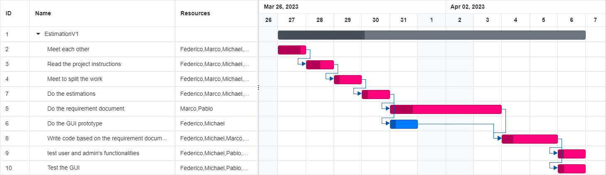

# Project Estimation - CURRENT

Date: 22/04/2023

Version: 1.0

# Estimation approach

Consider the EZWallet project in CURRENT version (as received by the teachers), assume that you are going to develop the project INDEPENDENT of the deadlines of the course

# Estimate by size

###

|                                                                                                         | Estimate |
| ------------------------------------------------------------------------------------------------------- | -------- |
| NC = Estimated number of classes to be developed # should be modules and not classes                    | 12       |
| A = Estimated average size per class, in LOC                                                            | 60.4     |
| S = Estimated size of project, in LOC (= NC \* A)                                                       | 725      |
| E = Estimated effort, in person hours (here use productivity 10 LOC per person hour)                    | 72.5     |
| C = Estimated cost, in euro (here use 1 person hour cost = 30 euro)                                     | 2175     |
| Estimated calendar time, in calendar weeks (Assume team of 4 people, 8 hours per day, 5 days per week ) | 0.45     |

# Estimate by product decomposition

###

| component name       | Estimated effort (person hours) |
| -------------------- | ------------------------------- |
| requirement document | 26                              |
| GUI prototype        | 12                              |
| design document      | 5                               |
| code                 | 40                              |
| unit tests           | 14                              |
| api tests            | 19                              |
| management documents | 4                               |

# Estimate by activity decomposition

###

| Activity name                                                  | Estimated effort (person hours) |
| -------------------------------------------------------------- | ------------------------------- |
| Get to meet eachother                                          | 1                               |
| Read the project instructions                                  | 10                              |
| Meet to split the work                                         | 1.5                             |
| Do the estimations                                             | 3                               |
| Do the Requirement document                                    | 26                              |
| Do the GUI prototype                                           | 12                              |
| Write code based on the Requirement document and GUI prototype | 40                              |
| Test user functionalities                                      | 12                              |
| Meet to review our work                                        | 12                              |

###

**Notes:** • The coding activity requires 4 days because no work is being done on Saturday and Sunday. \
 • The activities which belong to the critical path are colored in red.

# Summary

Report here the results of the three estimation approaches. The estimates may differ. Discuss here the possible reasons for the difference

|                                    | Estimated effort   | Estimated duration  |
| ---------------------------------- | ------------------ | ------------------- |
| estimate by size                   | 72.5 person hours  | 0.45 calendar weeks |
| estimate by product decomposition  | 120 person hours   | 0.75 calendar weeks |
| estimate by activity decomposition | 117.5 person hours | 0.73 calendar weeks |

The main reason behind the differences in the 3 estimations is the amount of details taken into account in each one of them. For the "estimate by size", the estimate time for each LOC written implicitly contains the time required to actually write the code, plus the documentation, meetings... so it might not be accurate. The " Estimate by product decomposition" is a bit more detailed than the previous method and resulted in a greater estimated effort (120 person hours compared to 72.5). The "Estimate by activity decomposition" is the most detailed as each single activity is taken into account and resulted in an estimated effort which is in between the previous 2 estimates
(72.5 < 117.5 < 120)
