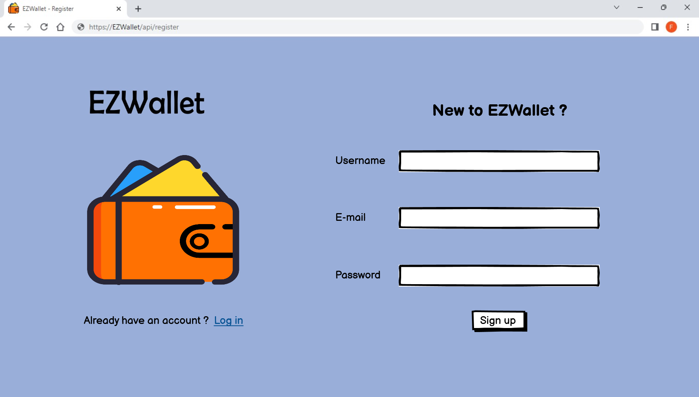
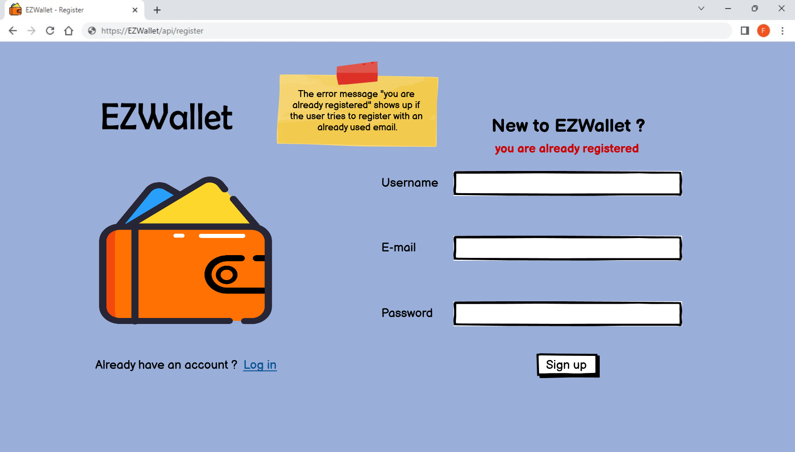
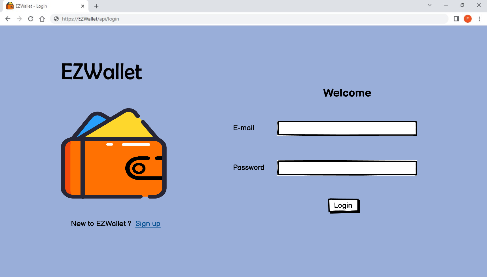
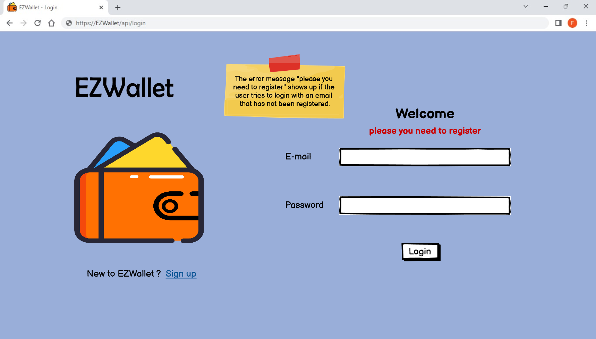
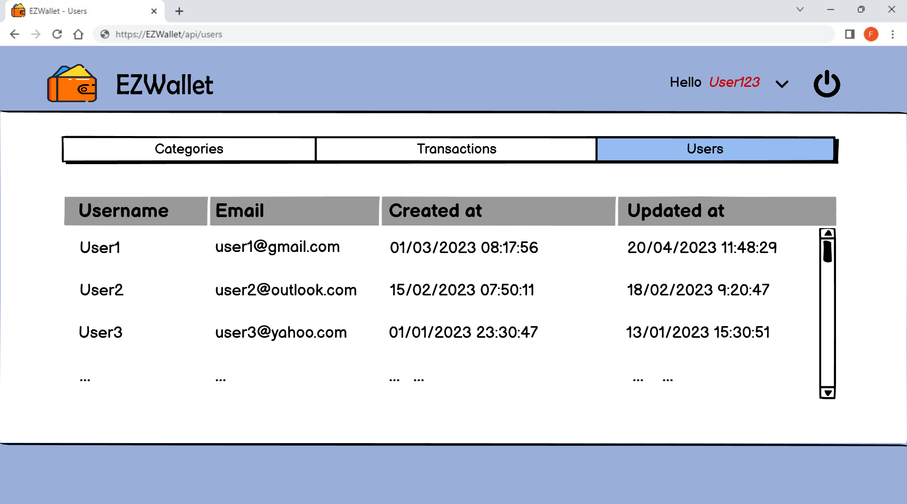
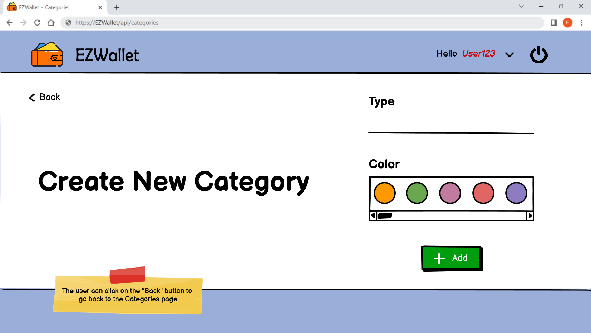
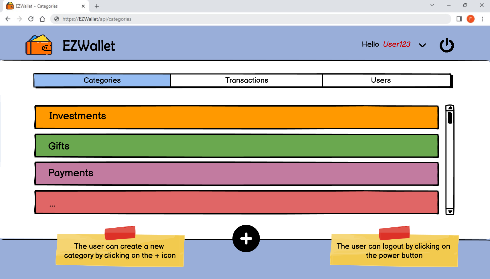
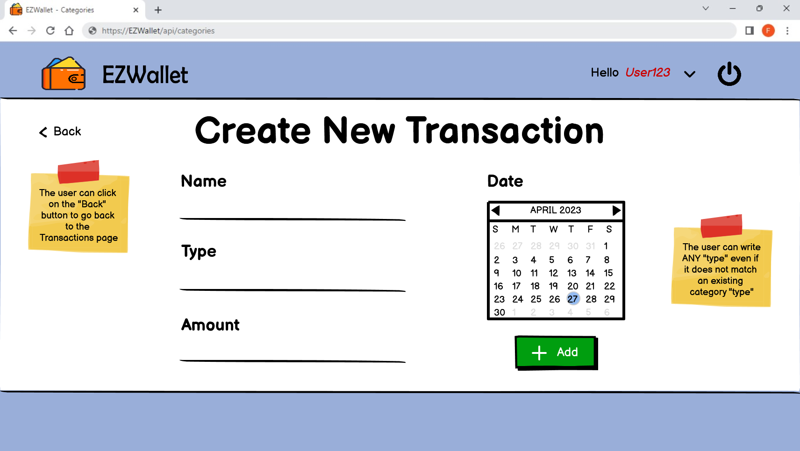
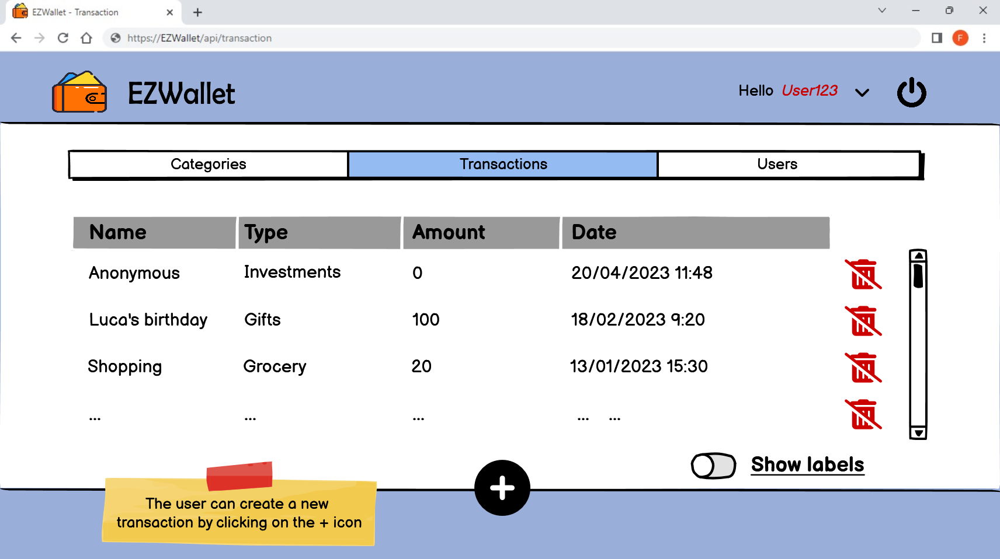
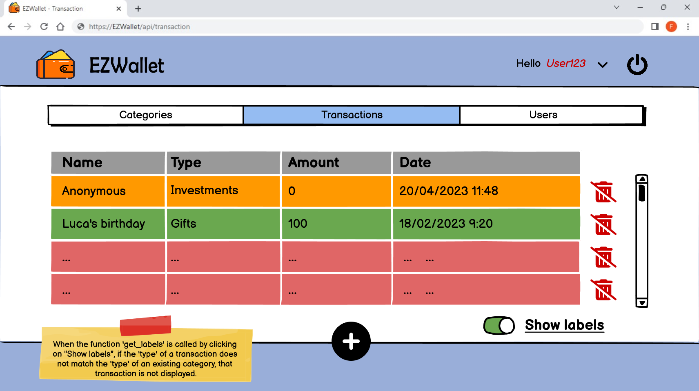

# Graphical User Interface Prototype  - CURRENT

Authors: Federico Castriotta

Date: 26/04/2023

Version: 1.0

# Contents

- [Graphical User Interface Prototype  - CURRENT](#graphical-user-interface-prototype----current)
- [Contents](#contents)
- [Use case 1, Manage User Account](#use-case-1-manage-user-account)
  - [Use case 1.1, Define a new user](#use-case-11-define-a-new-user)
  - [Use case 1.2, Login](#use-case-12-login)
- [Use case 1.3, Logout](#use-case-13-logout)
- [Use case 2, Retrieve user information](#use-case-2-retrieve-user-information)
  - [Use case 2.1, Get all users](#use-case-21-get-all-users)
  - [Use case 2.2, Get user by username](#use-case-22-get-user-by-username)
  - [Use case 3, Manage categories](#use-case-3-manage-categories)
    - [Use case 3.1, Create category](#use-case-31-create-category)
    - [Use case 3.2, Get categories](#use-case-32-get-categories)
  - [Use case 4, Manage transactions](#use-case-4-manage-transactions)
    - [Use case 4.1, Create transaction](#use-case-41-create-transaction)
    - [Use case 4.2, Get all transactions](#use-case-42-get-all-transactions)
    - [Use case 4.3, Delete transaction](#use-case-43-delete-transaction)
  - [Use case 5, Get all labels](#use-case-5-get-all-labels)

# Use case 1, Manage User Account

## Use case 1.1, Define a new user

## Use case 1.2, Login

# Use case 1.3, Logout

After the user logged in, the logout can be performed by clicking on the  icon displayed in the right top corner of each page.

# Use case 2, Retrieve user information

## Use case 2.1, Get all users

## Use case 2.2, Get user by username

## Use case 3, Manage categories

### Use case 3.1, Create category

### Use case 3.2, Get categories

## Use case 4, Manage transactions

### Use case 4.1, Create transaction

### Use case 4.2, Get all transactions

### Use case 4.3, Delete transaction

The user can delete a transaction by clicking on the  icon displayed next to each transaction.

## Use case 5, Get all labels

