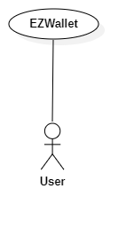
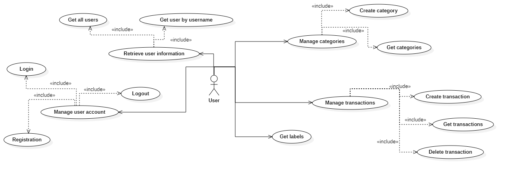
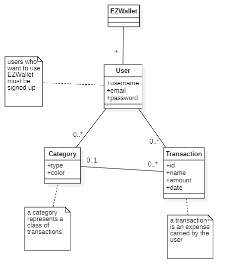
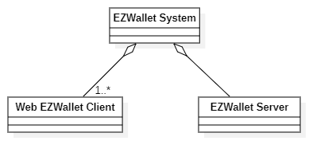
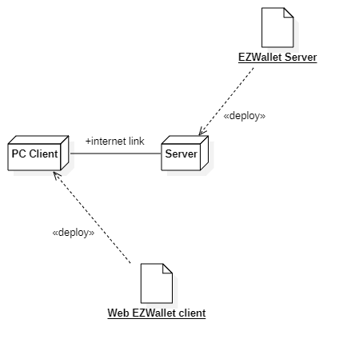

# Requirements Document - current EZWallet

Date: 26/04/2023

Version: V1 - description of EZWallet in CURRENT form (as received by teachers)

| Version number | Change                                                        |
| -------------- | :------------------------------------------------------------ |
| 1.1            | Informal description and stakeholders added                   |
| 1.2            | Context diagram and interfaces and stories and personas added |
| 1.3            | Use case diagram added                                        |
| 1.4            | Use cases added                                               |
| 1.5            | Glossary added                                                |
| 1.6            | System design and deployment diagram                          |
| 1.7            | Defect table added                                            |
| 1.8            | Notes added                                                   |

# Contents

- [Requirements Document - current EZWallet](#requirements-document---current-ezwallet)
- [Contents](#contents)
- [Informal description](#informal-description)
- [Stakeholders](#stakeholders)
- [Context Diagram and interfaces](#context-diagram-and-interfaces)
  - [Context Diagram](#context-diagram)
  - [Interfaces](#interfaces)
- [Stories and personas](#stories-and-personas)
- [Functional and non functional requirements](#functional-and-non-functional-requirements)
  - [Functional Requirements](#functional-requirements)
    - [Access right, actor vs function](#access-right-actor-vs-function)
  - [Non Functional Requirements](#non-functional-requirements)
- [Use case diagram and use cases](#use-case-diagram-and-use-cases)
  - [Use case diagram](#use-case-diagram)
    - [Use case 1, Manage User Account](#use-case-1-manage-user-account)
      - [Use case 1.1, Define a new user](#use-case-11-define-a-new-user)
        - [Scenario 1.1.1 (Nominal Scenario)](#scenario-111-nominal-scenario)
      - [Use case 1.2, Login](#use-case-12-login)
        - [Scenario 1.2.1 (Nominal Scenario)](#scenario-121-nominal-scenario)
      - [Use case 1.3, Logout](#use-case-13-logout)
    - [Use case 2, Retrieve user information](#use-case-2-retrieve-user-information)
      - [Use case 2.1, Get all users](#use-case-21-get-all-users)
      - [Use case 2.2, Get user by username](#use-case-22-get-user-by-username)
    - [Use case 3, Manage categories](#use-case-3-manage-categories)
      - [Use case 3.1, Create category](#use-case-31-create-category)
        - [Scenario 3.1.1 (Nominal Scenario)](#scenario-311-nominal-scenario)
      - [Use case 3.2, Get categories](#use-case-32-get-categories)
    - [Use case 4, Manage transactions](#use-case-4-manage-transactions)
      - [Use case 4.1, Create transaction](#use-case-41-create-transaction)
        - [Scenario 4.1.1 (Nominal Scenario)](#scenario-411-nominal-scenario)
      - [Use case 4.2, Get all transactions](#use-case-42-get-all-transactions)
      - [Use case 4.3, Delete transaction](#use-case-43-delete-transaction)
    - [Use case 5, Get all labels](#use-case-5-get-all-labels)
- [Glossary](#glossary)
- [System Design](#system-design)
- [Deployment Diagram](#deployment-diagram)
- [Defect table](#defect-table)
- [Notes/Improvements](#notesimprovements)

# Informal description

EZWallet (read EaSy Wallet) is a software application designed to help individuals and families keep track of their expenses. Users can enter and categorize their expenses, allowing them to quickly see where their money is going. EZWallet is a powerful tool for those looking to take control of their finances and make informed decisions about their spending.

# Stakeholders

| Stakeholder name |                      Description                       |
| ---------------- | :----------------------------------------------------: |
| User             |   Uses the application to categorize their expenses    |
| Developer        | Funds the development and operation of the application |

# Context Diagram and interfaces

## Context Diagram

## Interfaces

| Actor | Logical Interface | Physical Interface          |
| ----- | :---------------- | :-------------------------- |
| User  | Web GUI           | Screen keyboard mouse on PC |

# Stories and personas

The following personas and stories are meant to cover different profiles of the User actor.

• Persona 1: Sarah, university student and part time worker, 22 yo, female and single.\
Sarah struggled with expenses until she tried EZWallet. Categorizing expenses helped her see where to cut back. She set budgets and saved for goals, improving her financial situation. EZWallet made managing money easy for Sarah.

• Persona 2: Emily, middle class, 46 yo, female, married with 2 kids.\
Emily was always stressed about money. She had a decent job, but she struggled to make ends meet each month. She tried keeping track of her expenses in a notebook, but found it tedious and time-consuming.
One day, a friend recommended EZWallet to Emily.
With EZWallet's categorization feature, Emily was able to see exactly where her money was going. She was shocked to see how much she was spending on shopping and takeout, and decided to make changes to her spending habits.
As a result, Emily was able to reduce her stress levels and gain a sense of control over her finances. She was grateful to her friend for recommending EZWallet, and knew she would continue using the app to manage her money going forward.

• Persona 3: Clara and Luca, female and male, 27 yo.\
They are planning to get married next year and get full independence, but since they are young they don't have still the money savings necessary to make it. EZWallet will allow them manging their money so that they can celebrate the wedding and invite all their friends and family.

# Functional and non functional requirements

## Functional Requirements

| ID    |        Description        |
| ----- | :-----------------------: |
| FR1   |    Manage User Account    |
| FR1.1 |     Define a new user     |
| FR1.2 |       Log in a user       |
| FR1.3 |      Log out a user       |
| FR2   | Retrieve user information |
| FR2.1 |       Get all users       |
| FR2.2 |   Find user by username   |
| FR3   |     Manage categories     |
| FR3.1 |      Create category      |
| FR3.2 |    Get all categories     |
| FR4   |    Manage transactions    |
| FR4.1 |    Create transaction     |
| FR4.2 |   Get all transactions    |
| FR4.3 |    Delete transaction     |
| FR5   |      Get all labels       |

### Access right, actor vs function

| Function | User |
| -------- | :--: |
| FR1.1    | yes  |
| FR1.2    | yes  |
| FR1.3    | yes  |
| FR2.1    | yes  |
| FR2.2    | yes  |
| FR3.1    | yes  |
| FR3.2    | yes  |
| FR4.1    | yes  |
| FR4.2    | yes  |
| FR4.3    | yes  |
| FR5      | yes  |

## Non Functional Requirements

| ID   |      Type       | Description                                                                                                                                                                                                                                                                                                                                                                 |        Refers to |
| ---- | :-------------: | :-------------------------------------------------------------------------------------------------------------------------------------------------------------------------------------------------------------------------------------------------------------------------------------------------------------------------------------------------------------------------- | ---------------: |
| NFR1 |    Usability    | Application should be used with no specific training for the users and the tasks should be carried out in a limited amount of time (5 min registration, 1 minute login, etc.)                                                                                                                                                                                               |           All FR |
| NFR2 |   Performance   | Response time should be < 1 sec                                                                                                                                                                                                                                                                                                                                             |           FR 1.1 |
| NFR3 |   Performance   | Response time should be < 1.5 sec                                                                                                                                                                                                                                                                                                                                           |   FR 2.1 and 2.2 |
| NFR4 |   Performance   | Response time should be < 0.5 sec                                                                                                                                                                                                                                                                                                                                           | All remaining FR |
| NFR5 |   Portability   | The application should be accessed by Chrome (version 81 and more recent), and Safari (version 13 and more recent) (this covers around 80% of installed browsers); and from the operating systems where these browsers are available (Android, IoS, Windows, MacOS, Unix). As for devices, the application should be usable on smartphones (landscape) and PCs (landscape). |           All FR |
| NFR6 |    Security     | Ensure that the application protects its users and data from security incidents and unauthorized access, and complies with security regulations and standards                                                                                                                                                                                                               |           All FR |
| NFR7 | Maintainability | Less than 3 hours to fix a defect/bug                                                                                                                                                                                                                                                                                                                                       |           All FR |

# Use case diagram and use cases

## Use case diagram

### Use case 1, Manage User Account

#### Use case 1.1, Define a new user

| Actors Involved  |                                         User                                         |
| ---------------- | :----------------------------------------------------------------------------------: |
| Precondition     |                         User isn't registered in the system                          |
| Post condition   |                           User is registered in the system                           |
| Nominal Scenario |                      User asks to sign up and inserts credentials                       |
| Variants         |                                                                                      |
| Exceptions       | If user is already registered the message "you are already registered" will be shown |

##### Scenario 1.1.1 (Nominal Scenario)

| Scenario 1.1.1 |                                          |
| -------------- | :--------------------------------------: |
| Precondition   |   User isn't registered in the system    |
| Post condition |     User is registered in the system     |
| Step#          |               Description                |
| 1              |           User asks to sign up           |
| 2              | System asks username, email and password |
| 3              |         User enters credentials          |
| 4              |        System stores credentials         |

#### Use case 1.2, Login

| Actors Involved  |                                                                                                                                      User                                                                                                                                      |
| ---------------- | :----------------------------------------------------------------------------------------------------------------------------------------------------------------------------------------------------------------------------------------------------------------------------: |
| Precondition     |                                                                                                            User is registered in the system. User is not logged in                                                                                                             |
| Post condition   |                                                                                                                               User is logged in                                                                                                                                |
| Nominal Scenario |                                                                                                               User asks to login and inserts email and password                                                                                                                |
| Variants         |                                                                                                                                                                                                                                                                                |
| Exceptions       | If user is already logged in the response "you are already logged in" will be returned (status 200). If credentials are wrong the message "wrong credentials" will be shown (status 400). If user isn't registered the message "please you need to register" will be displayed |

##### Scenario 1.2.1 (Nominal Scenario)

| Scenario 1.2.1 |                                                         |
| -------------- | :-----------------------------------------------------: |
| Precondition   | User is registered in the system. User is not logged in |
| Post condition |              User is logged in the system               |
| Step#          |                       Description                       |
| 1              |                   User asks to login                    |
| 2              |        System asks username, email and password         |
| 3              |                 User enters credentials                 |
| 4              |                 System authorizes user                  |

#### Use case 1.3, Logout

| Actors Involved  |                                           User                                           |
| ---------------- | :--------------------------------------------------------------------------------------: |
| Precondition     |                                    User is logged in.                                    |
| Post condition   |                                   User is logged out.                                    |
| Nominal Scenario |                                User asks to exit the app.                                |
| Variants         |                                                                                          |
| Exceptions       | If user is already logged out the response "you are already logged out" will be returned |

### Use case 2, Retrieve user information

#### Use case 2.1, Get all users

| Actors Involved  |                             User                             |
| ---------------- | :----------------------------------------------------------: |
| Precondition     |                                                              |
| Post condition   |                    List of users is shown                    |
| Nominal Scenario | Systems shows all of the users registered in the application |
| Variants         |                                                              |
| Exceptions       |                                                              |

#### Use case 2.2, Get user by username

| Actors Involved  |                                  User                                  |
| ---------------- | :--------------------------------------------------------------------: |
| Precondition     |                           User is logged in                            |
| Post condition   |                      User information is returned                      |
| Nominal Scenario |             User asks to see his/her personal information              |
| Variants         |                                                                        |
| Exceptions       | If user is not authorized the message "Unauthorized" will be returned. |

### Use case 3, Manage categories

#### Use case 3.1, Create category

| Actors Involved  |                                  User                                  |
| ---------------- | :--------------------------------------------------------------------: |
| Precondition     |                         Category doesn't exist                         |
| Post condition   |                            Category exists                             |
| Nominal Scenario |                      User creates a new category                       |
| Variants         |                                                                        |
| Exceptions       | If user is not authorized the message "Unauthorized" will be returned. |

##### Scenario 3.1.1 (Nominal Scenario)

| Scenario 3.1.1 |                                  |
| -------------- | :------------------------------: |
| Precondition   |      Category doesn't exist      |
| Post condition |         Category exists          |
| Step#          |           Description            |
| 1              | User asks to create new category |
| 2              |  System asks for type and color  |
| 3              |    User enters type and color    |
| 4              |   System creates new category    |

#### Use case 3.2, Get categories

| Actors Involved  |                                  User                                  |
| ---------------- | :--------------------------------------------------------------------: |
| Precondition     |                           Categories exist.                            |
| Post condition   |                         Categories are shown.                          |
| Nominal Scenario |                 User asks for categories to be shown.                  |
| Variants         |                                                                        |
| Exceptions       | If user is not authorized the message "Unauthorized" will be returned. |

### Use case 4, Manage transactions

#### Use case 4.1, Create transaction

| Actors Involved  |                                  User                                  |
| ---------------- | :--------------------------------------------------------------------: |
| Precondition     |                       Transaction doesn't exist                        |
| Post condition   |                           Transaction exists                           |
| Nominal Scenario |                     User creates a new transaction                     |
| Variants         |                                                                        |
| Exceptions       | If user is not authorized the message "Unauthorized" will be returned. |

##### Scenario 4.1.1 (Nominal Scenario)

| Scenario 1.1.1 |                                       |
| -------------- | :-----------------------------------: |
| Precondition   |       Transaction doesn't exist       |
| Post condition |          Transaction exists           |
| Step#          |              Description              |
| 1              |  User asks to insert new transaction  |
| 2              | System asks for name, amount and type |
| 3              |   User enters name, amount and type   |
| 4              |     System stores new transaction     |

#### Use case 4.2, Get all transactions

| Actors Involved  |                                  User                                  |
| ---------------- | :--------------------------------------------------------------------: |
| Precondition     |                           Transactions exist                           |
| Post condition   |                        Transactions are shown.                         |
| Nominal Scenario |                   User asks to get the transactions                    |
| Variants         |                                                                        |
| Exceptions       | If user is not authorized the message "Unauthorized" will be returned. |

#### Use case 4.3, Delete transaction

| Actors Involved  |                                  User                                  |
| ---------------- | :--------------------------------------------------------------------: |
| Precondition     |                   Transaction exists in the system.                    |
| Post condition   |                Transaction doesn't exist in the system.                |
| Nominal Scenario |              User deletes one transaction from the system              |
| Variants         |                                                                        |
| Exceptions       | If user is not authorized the message "Unauthorized" will be returned. |

### Use case 5, Get all labels

| Actors Involved  |                                  User                                  |
| ---------------- | :--------------------------------------------------------------------: |
| Precondition     |                   Transaction and categories exist.                    |
| Post condition   |                       Transactions get a color.                        |
| Nominal Scenario |    User assign a color to a transaction according to its category.     |
| Variants         |                                                                        |
| Exceptions       | If user is not authorized the message "Unauthorized" will be returned. |

# Glossary

# System Design

# Deployment Diagram

# Defect table

| Defected function | Defect                                                                                                                        | Fix                                                                                                                                           |
| ----------------- | ----------------------------------------------------------------------------------------------------------------------------- | --------------------------------------------------------------------------------------------------------------------------------------------- |
| get_labels        | let data = result.map(v => Object.assign({}, { \_id: v.\_id, name: v.name, amount: v.amount, type: v.type, color: v.color })) | let data = result.map(v => Object.assign({}, { \_id: v.\_id, name: v.name, amount: v.amount, type: v.type, color: v.categories_info.color })) |
| getUsers          | The "getUsers" function can be accessed by users who are not logged in                                                        | The "getUsers" function can be accessed by users who must be logged in                                                                        |

# Notes/Improvements

• The "getUsers" function can be accessed by any user, there should be an "admin" class which only has the privileges to access this function.

• In the current version of the application there is no seperate wallet for each user. For example if user1 adds a transaction, the same transaction can be seen by ALL other users, which defeats the whole purpose of the app. The fix here is to pack transactions into wallets which are property of a specific user or a group of users, then only these user(s) can add or delete transaction(s) in that wallet.
