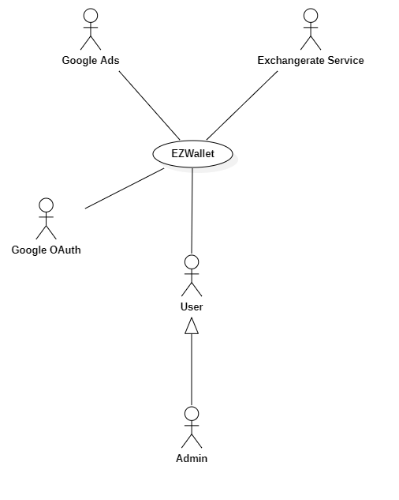
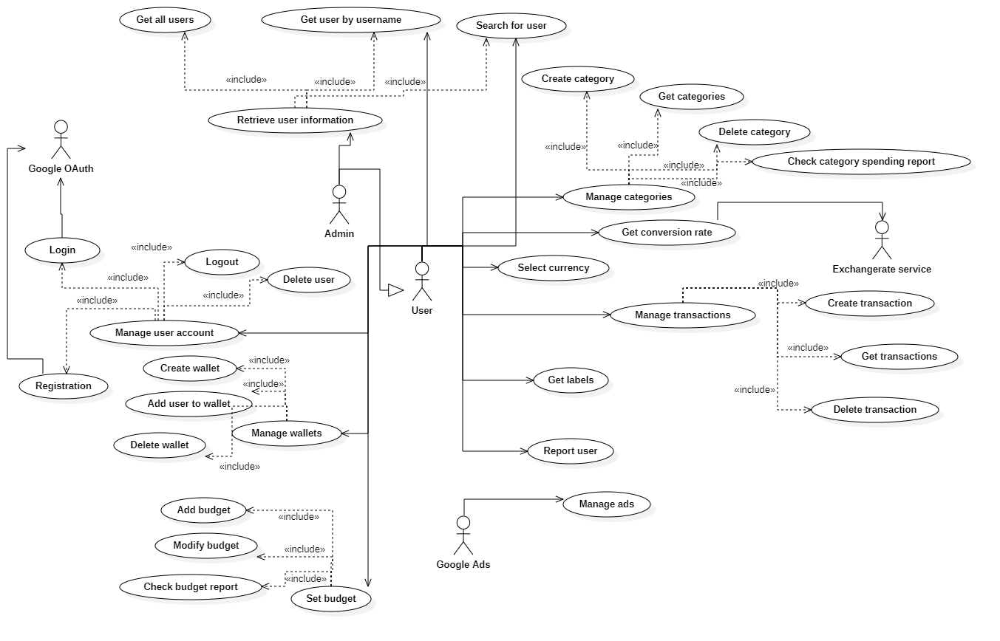
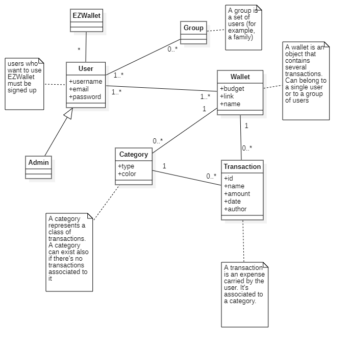
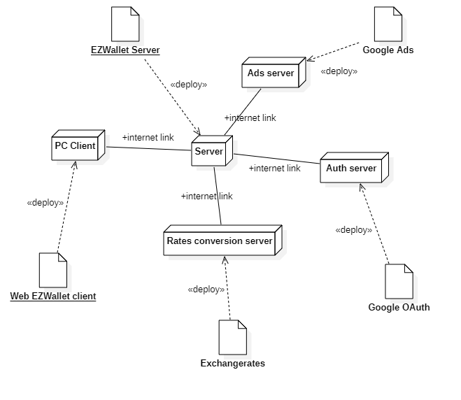

# Requirements Document - future EZWallet

Date: 28/04/2023

Version: V2 - description of EZWallet in FUTURE form (as proposed by the team)

| Version number | Change                                           |
| -------------- | :----------------------------------------------- |
| 2.1            | Informal description and stakeholders added      |
| 2.2            | Context diagram and interfaces                   |
| 2.3            | Copied the same stories from V1 and added 3 more |
| 2.4            | Informal description and stakeholders added                   |
| 2.5            | Context diagram and interfaces and stories and personas added |
| 2.6            | New FR and NFR added                                          |
| 2.7            | Use case diagram added                                        |
| 2.8            | Use cases added                                               |
| 2.9            | FR, Use cases and Use case diagram modified                   |
| 2.10           | Glossary added                                                |
| 2.11           | Glossary modified                                             |
| 2.12           | System design and deployment diagram added                    |
| 2.13           | Notes added                                                   |

# Contents

- [Requirements Document - future EZWallet](#requirements-document---future-ezwallet)
- [Contents](#contents)
- [Informal description](#informal-description)
- [Stakeholders](#stakeholders)
- [Context Diagram and interfaces](#context-diagram-and-interfaces)
  - [Context Diagram](#context-diagram)
  - [Interfaces](#interfaces)
- [Stories and personas](#stories-and-personas)
- [Functional and non functional requirements](#functional-and-non-functional-requirements)
  - [Functional Requirements](#functional-requirements)
    - [Access right, actor vs function](#access-right-actor-vs-function)
  - [Non Functional Requirements](#non-functional-requirements)
- [Use case diagram and use cases](#use-case-diagram-and-use-cases)
  - [Use case diagram](#use-case-diagram)
    - [Use case 1, Manage User Account](#use-case-1-manage-user-account)
      - [Use case 1.1, Define a new user](#use-case-11-define-a-new-user)
        - [Scenario 1.1.1 (Nominal Scenario)](#scenario-111-nominal-scenario)
        - [Scenario 1.1.2 (Registration through Google account)](#scenario-112-registration-through-google-account)
      - [Use case 1.2, Login](#use-case-12-login)
        - [Scenario 1.2.1 (Nominal Scenario)](#scenario-121-nominal-scenario)
        - [Scenario 1.2.2 (Login through Google account)](#scenario-122-login-through-google-account)
      - [Use case 1.3, Logout](#use-case-13-logout)
      - [Use case 1.4, Delete user](#use-case-14-delete-user)
        - [Scenario 1.4.1 (Nominal Scenario)](#scenario-141-nominal-scenario)
        - [Scenario 1.4.2 (Admin deletes user account)](#scenario-142-admin-deletes-user-account)
    - [Use case 2, Retrieve user information](#use-case-2-retrieve-user-information)
      - [Use case 2.1, Get all users](#use-case-21-get-all-users)
      - [Use case 2.2, Get user by username](#use-case-22-get-user-by-username)
      - [Use case 2.3, Search for user](#use-case-23-search-for-user)
    - [Use case 3, Manage categories](#use-case-3-manage-categories)
      - [Use case 3.1, Create category](#use-case-31-create-category)
        - [Scenario 3.1.1 (Nominal Scenario)](#scenario-311-nominal-scenario)
      - [Use case 3.2, Get categories](#use-case-32-get-categories)
      - [Use case 3.3, Delete category](#use-case-33-delete-category)
      - [Use case 3.4, Check category spending reports](#use-case-34-check-category-spending-reports)
    - [Use case 4, Manage transactions](#use-case-4-manage-transactions)
      - [Use case 4.1, Create transaction](#use-case-41-create-transaction)
        - [Scenario 4.1.1 (Nominal Scenario)](#scenario-411-nominal-scenario)
      - [Use case 4.2, Get all transactions](#use-case-42-get-all-transactions)
        - [Scenario 4.2.1 (Nominal Scenario)](#scenario-421-nominal-scenario)
      - [Use case 4.3, Delete transaction](#use-case-43-delete-transaction)
    - [Use case 5, Get all labels](#use-case-5-get-all-labels)
    - [Use case 6, Manage ads](#use-case-6-manage-ads)
    - [Use case 7, Manage Wallet](#use-case-7-manage-wallet)
      - [Use case 7.1, Add wallet](#use-case-71-add-wallet)
        - [Scenario 7.1.1 (Nominal Scenario)](#scenario-711-nominal-scenario)
      - [Use case 7.2, Add user to wallet](#use-case-72-add-user-to-wallet)
        - [Scenario 7.2.1 (Nominal Scenario)](#scenario-721-nominal-scenario)
      - [Use case 7.3, Delete wallet](#use-case-73-delete-wallet)
    - [Use case 8, Set budget](#use-case-8-set-budget)
      - [Use case 8.1, Add budget](#use-case-81-add-budget)
        - [Scenario 8.1.1 (Nominal Scenario)](#scenario-811-nominal-scenario)
      - [Use case 8.2, Modify budget](#use-case-82-modify-budget)
      - [Use case 8.3, Check budget reports](#use-case-83-check-budget-reports)
    - [Use case 9, Get conversion rate](#use-case-9-get-conversion-rate)
    - [Use case 10, Select currency](#use-case-10-select-currency)
    - [Use case 11, Report user](#use-case-11-report-user)
- [Glossary](#glossary)
- [System Design](#system-design)
- [Deployment Diagram](#deployment-diagram)
- [Notes/Improvements](#notesimprovements)

# Informal description

EZWallet (read EaSy Wallet) is a software application designed to help individuals and families keep track of their expenses. Users can enter and categorize their expenses, allowing them to quickly see where their money is going. EZWallet is a powerful tool for those looking to take control of their finances and make informed decisions about their spending.

# Stakeholders

| Stakeholder name     |                                         Description                                          |
| -------------------- | :------------------------------------------------------------------------------------------: |
| User                 |                      Uses the application to categorize their expenses                       |
| Developer            |                    Funds the development and operation of the application                    |
| Admin                | Manages the application, can use special functionalities to look up for users, can ban users |
| Google Ads           |                       Advertises companies products on the application                       |
| Google OAuth         |                          Authorizes users to access the application                          |
| Exchangerate Service |                 Takes care of conversion rates between different currencies                  |

# Context Diagram and interfaces

## Context Diagram

## Interfaces

| Actor                 | Logical Interface | Physical Interface                                      |
| --------------------- | :---------------- | :------------------------------------------------------ |
| User                  | Web GUI           | Screen keyboard mouse on PC                             |
| Admin                 | Web GUI           | Screen keyboard mouse on PC                             |
| Google Ads            | Internet link     | https://developers.google.com/google-ads/api/docs/start |
| Google OAuth          | Internet link     | https://developers.google.com/identity/protocols/oauth2 |
| Exchangerates Service | Internet link     | https://exchangeratesapi.io/documentation/              |

# Stories and personas

The following personas and stories are meant to cover different profiles of the User actor.

• Persona 1: Sarah, university student and part time worker, 22 yo, female and single.\
Sarah struggled with expenses until she tried EZWallet. Categorizing expenses helped her see where to cut back. She set budgets and saved for goals, improving her financial situation. EZWallet made managing money easy for Sarah.

• Persona 2: Emily, middle class, 46 yo, female, married with 2 kids.\
Emily was always stressed about money. She had a decent job, but she struggled to make ends meet each month. She tried keeping track of her expenses in a notebook, but found it tedious and time-consuming.
One day, a friend recommended EZWallet to Emily.
With EZWallet's categorization feature, Emily was able to see exactly where her money was going. She was shocked to see how much she was spending on shopping and takeout, and decided to make changes to her spending habits.
As a result, Emily was able to reduce her stress levels and gain a sense of control over her finances. She was grateful to her friend for recommending EZWallet, and knew she would continue using the app to manage her money going forward.

• Persona 3: Clara and Luca, female and male, 27 yo.\
They are planning to get married next year and get full independence, but since they are young they don't have still the money savings necessary to make it. EZWallet will allow them manging their money so that they can celebrate the wedding and invite all their friends and family.

• Persona 4: Oliver, 31 yo male, an admin for EZWallet. \
After receiving multiple reports on a specific user, Oliver searches for this user and deletes his account.

• Persona 5: Marco, 46 yo male, Emma, 44 yo female, married with 2 sons in their early twenties. \
Due to the inflation taking place nowadays, Marco and his family decided to track their expenses and income in order to better manage their finances. They chose EZWallet for that job, Marco created a wallet and added all his family members to it. After constantly checking the "report" of their wallet, they realized that they were overspending in the category "entertainment", thus cutting expenses regarding that category.

• Persona 6: Antony, 24 yo male, university student. \
Antony and his friends (all university students), decided to go on a trip to Spain for 1 week. He decided to use EZWallet to track their expenses, so he added all his friends to a wallet that he created. This helped them to better understand where and how their money was spent, for example they noticed that they overspent on eating out, where they could have visited more attractions using the wasted money. This way they are more prepared for their next trip in the future. After the trip was done they deleted the wallet.

# Functional and non functional requirements

## Functional Requirements

| ID    |           Description           |
| ----- | :-----------------------------: |
| FR1   |       Manage User Account       |
| FR1.1 |        Define a new user        |
| FR1.2 |          Log in a user          |
| FR1.3 |         Log out a user          |
| FR1.4 |       Delete user account       |
| FR2   |    Retrieve user information    |
| FR2.1 |          Get all users          |
| FR2.2 |      Find user by username      |
| FR2.3 |         Search for user         |
| FR3   |        Manage categories        |
| FR3.1 |         Create category         |
| FR3.2 |       Get all categories        |
| FR3.3 |         Delete category         |
| FR3.4 | Check category spending reports |
| FR4   |       Manage transactions       |
| FR4.1 |       Create transaction        |
| FR4.2 |      Get all transactions       |
| FR4.3 |       Delete transaction        |
| FR5   |         Get all labels          |
| FR6   |           Manage Ads            |
| FR7   |          Manage Wallet          |
| FR7.1 |           Add wallet            |
| FR7.2 |       Add users to wallet       |
| FR7.3 |          Delete wallet          |
| FR8   |           Set budget            |
| FR8.1 |           Add budget            |
| FR8.2 |          Modify budget          |
| FR8.3 |      Check budget reports       |
| FR9   |       Get conversion rate       |
| FR10  |         Select currency         |
| FR11  |           Report user           |

### Access right, actor vs function

| Function | User | Admin | Google Ads | Google OAuth | Exchangerate Service |
| -------- | :--: | ----- | ---------- | ------------ | -------------------- |
| FR1.1    | yes  | yes   | no         | yes          | no                   |
| FR1.2    | yes  | yes   | no         | yes          | no                   |
| FR1.3    | yes  | yes   | no         | no           | no                   |
| FR1.4    | yes  | yes   | no         | no           | no                   |
| FR2.1    |  no  | yes   | no         | no           | no                   |
| FR2.2    | yes  | yes   | no         | no           | no                   |
| FR2.3    |  no  | yes   | no         | no           | no                   |
| FR3      | yes  | yes   | no         | no           | no                   |
| FR4      | yes  | yes   | no         | no           | no                   |
| FR5      | yes  | yes   | no         | no           | no                   |
| FR6      |  no  | no    | yes        | no           | no                   |
| FR7      | yes  | yes   | no         | no           | no                   |
| FR8      | yes  | yes   | no         | no           | no                   |
| FR9      |  no  | no    | no         | no           | yes                  |
| FR10     | yes  | yes   | no         | no           | no                   |
| FR11     | yes  | yes   | no         | no           | no                   |

## Non Functional Requirements

| ID    |      Type       | Description                                                                                                                                                                                                                                                                                                                                                                 |        Refers to |
| ----- | :-------------: | :-------------------------------------------------------------------------------------------------------------------------------------------------------------------------------------------------------------------------------------------------------------------------------------------------------------------------------------------------------------------------- | ---------------: |
| NFR1  |    Usability    | Application should be used with no specific training for the users and the tasks should be carried out in a limited amount of time (5 min registration, 1 minute login, etc.)                                                                                                                                                                                               |           All FR |
| NFR2  |   Performance   | Response time should be < 1 sec                                                                                                                                                                                                                                                                                                                                             |           FR 1.1 |
| NFR3  |   Performance   | Response time should be < 1.5 sec                                                                                                                                                                                                                                                                                                                                           |   FR 2.1 and 2.2 |
| NFR4  |   Performance   | Response time should be < 0.5 sec                                                                                                                                                                                                                                                                                                                                           | All remaining FR |
| NFR5  |   Portability   | The application should be accessed by Chrome (version 81 and more recent), and Safari (version 13 and more recent) (this covers around 80% of installed browsers); and from the operating systems where these browsers are available (Android, IoS, Windows, MacOS, Unix). As for devices, the application should be usable on smartphones (landscape) and PCs (landscape). |           All FR |
| NFR6  |    Security     | Ensure that the application protects its users and data from security incidents and unauthorized access, and complies with security regulations and standards                                                                                                                                                                                                               |           All FR |
| NFR7  | Maintainability | Less than 3 hours to fix a defect/bug                                                                                                                                                                                                                                                                                                                                       |           All FR |
| NFR8  |     Privacy     | The data of one user should not be disclosed to other users                                                                                                                                                                                                                                                                                                                 |              FR2 |
| NFR9  |   Correctness   | Capability to provide correct currency conversions at all time                                                                                                                                                                                                                                                                                                              |              FR4 |
| NFR10 |     Domain      | The password inserted by the user should contain at least one upper case letter, one lower case letter, and one symbol                                                                                                                                                                                                                                                      |            FR1.1 |

# Use case diagram and use cases

## Use case diagram

### Use case 1, Manage User Account

#### Use case 1.1, Define a new user

| Actors Involved  |                                  User, Google OAuth                                  |
| ---------------- | :----------------------------------------------------------------------------------: |
| Precondition     |                         User isn't registered in the system                          |
| Post condition   |                           User is registered in the system                           |
| Nominal Scenario |                      User asks to sign and inserts credentials                       |
| Variants         |                    User asks to sign in with his Google account.                     |
| Exceptions       | If user is already registered the message "you are already registered" will be shown |

##### Scenario 1.1.1 (Nominal Scenario)

| Scenario 1.1.1 |                                           |
| -------------- | :---------------------------------------: |
| Precondition   |    User isn't registered in the system    |
| Post condition |     User is registered in the system      |
| Step#          |                Description                |
| 1              |           User asks to sign up            |
| 2              | System asks username, email and password. |
| 3              |          User enters credentials          |
| 4              |         System stores credentials         |

##### Scenario 1.1.2 (Registration through Google account)

| Scenario 1.1.2 |                                     |
| -------------- | :---------------------------------: |
| Precondition   | User isn't registered in the system |
| Post condition |  User is registered in the system   |
| Step#          |             Description             |
| 1              |  User asks to register with Google  |
| 2              |   System asks for Google account    |
| 3              |     User enters Google account      |
| 4              |   System registers user's account   |

#### Use case 1.2, Login

| Actors Involved  |                                                                                                                 User, Google OAuth                                                                                                                  |
| ---------------- | :-------------------------------------------------------------------------------------------------------------------------------------------------------------------------------------------------------------------------------------------------: |
| Precondition     |                                                                                               User is registered in the system. User is not logged in                                                                                               |
| Post condition   |                                                                                                                  User is logged in                                                                                                                  |
| Nominal Scenario |                                                                                                  User asks to login and inserts email and password                                                                                                  |
| Variants         |         User asks to log in with Google account                                                                                                                                                                                                                                            |
| Exceptions       | If user is already logged in the message "you are already logged in" will be returned. If credentials are wrong the message "wrong credentials" will be shown. If user isn't registered the message "please you need to register" will be displayed |

##### Scenario 1.2.1 (Nominal Scenario)

| Scenario 1.2.1 |                                                         |
| -------------- | :-----------------------------------------------------: |
| Precondition   | User is registered in the system. User is not logged in |
| Post condition |              User is logged in the system               |
| Step#          |                       Description                       |
| 1              |                   User asks to login                    |
| 2              |        System asks username, email and password         |
| 3              |                 User enters credentials                 |
| 4              |                 System authorizes user                  |

##### Scenario 1.2.2 (Login through Google account)

| Scenario 1.2.2 |                                       |
| -------------- | :-----------------------------------: |
| Precondition   |         User is not logged in         |
| Post condition |     User is logged in the system      |
| Step#          |              Description              |
| 1              |    System asks for Google account     |
| 2              | System looks up for the given account |
| 3              |        System authorizes user         |

#### Use case 1.3, Logout

| Actors Involved  |                                          User                                           |
| ---------------- | :-------------------------------------------------------------------------------------: |
| Precondition     |                                    User is logged in                                    |
| Post condition   |                                   User is logged out                                    |
| Nominal Scenario |                                User asks to exit the app                                |
| Variants         |                                                                                         |
| Exceptions       | If user is already logged out the message "you are already logged out" will be returned |

#### Use case 1.4, Delete user

| Actors Involved  |           User, Admin           |
| ---------------- | :-----------------------------: |
| Precondition     |       User is registered        |
| Post condition   | User is no longer in the system |
| Nominal Scenario |  User deletes his own account   |
| Variants         | Admin deletes/ban user account  |
| Exceptions       |                                 |

##### Scenario 1.4.1 (Nominal Scenario)

| Scenario 1.4.1 |                                                   |
| -------------- | :-----------------------------------------------: |
| Precondition   |                User is registered                 |
| Post condition |          User is no longer in the system          |
| Step#          |                    Description                    |
| 1              |        User asks to delete his own account        |
| 2              |       System looks up for the given account       |
| 3              | System removes user information from the database |

##### Scenario 1.4.2 (Admin deletes user account)

| Scenario 1.4.2 |                                                   |
| -------------- | :-----------------------------------------------: |
| Precondition   |                User is registered                 |
| Post condition |          User is no longer in the system          |
| Step#          |                    Description                    |
| 1              |         Admin asks to delete some account         |
| 2              |       System looks up for the given account       |
| 3              | System removes user information from the database |

### Use case 2, Retrieve user information

#### Use case 2.1, Get all users

| Actors Involved  |                            Admin                             |
| ---------------- | :----------------------------------------------------------: |
| Precondition     |                      Admin is logged in                      |
| Post condition   |                    List of users is shown                    |
| Nominal Scenario | Systems shows all of the users registered in the application |
| Variants         |                                                              |
| Exceptions       |                                                              |

#### Use case 2.2, Get user by username

| Actors Involved  |                                 User                                  |
| ---------------- | :-------------------------------------------------------------------: |
| Precondition     |                           User is logged in                           |
| Post condition   |                     User information is returned                      |
| Nominal Scenario |             User asks to see his/her personal information             |
| Variants         |                                                                       |
| Exceptions       | If user is not authorized the message "Unauthorized" will be returned |

#### Use case 2.3, Search for user

| Actors Involved  |                      Admin                      |
| ---------------- | :---------------------------------------------: |
| Precondition     |               Admin is logged in                |
| Post condition   |         Searched user is shown if found         |
| Nominal Scenario | Admin asks to find a user by using the username |
| Variants         |                                                 |
| Exceptions       |                                                 |

### Use case 3, Manage categories

#### Use case 3.1, Create category

| Actors Involved  |                                 User                                  |
| ---------------- | :-------------------------------------------------------------------: |
| Precondition     |                        Category doesn't exist                         |
| Post condition   |                            Category exists                            |
| Nominal Scenario |                      User creates a new category                      |
| Variants         |                                                                       |
| Exceptions       | If user is not authorized the message "Unauthorized" will be returned |

##### Scenario 3.1.1 (Nominal Scenario)

| Scenario 3.1.1 |                                  |
| -------------- | :------------------------------: |
| Precondition   |      Category doesn't exist      |
| Post condition |         Category exists          |
| Step#          |           Description            |
| 1              | User asks to create new category |
| 2              |  System asks for type and color  |
| 3              |    User enters type and color    |
| 4              |   System creates new category    |

#### Use case 3.2, Get categories

| Actors Involved  |                                 User                                  |
| ---------------- | :-------------------------------------------------------------------: |
| Precondition     |                           Categories exist                            |
| Post condition   |                         Categories are shown                          |
| Nominal Scenario |                 User asks for categories to be shown                  |
| Variants         |                                                                       |
| Exceptions       | If user is not authorized the message "Unauthorized" will be returned |

#### Use case 3.3, Delete category

| Actors Involved  |                  User                  |
| ---------------- | :------------------------------------: |
| Precondition     |            Category exists             |
| Post condition   |         Category doesn't exist         |
| Nominal Scenario | User asks for categories to be deleted |
| Variants         |                                        |
| Exceptions       |                                        |

#### Use case 3.4, Check category spending reports

| Actors Involved  |                       User                       |
| ---------------- | :----------------------------------------------: |
| Precondition     |                 Category exists                  |
| Post condition   | Spending report is shown for selected categories |
| Nominal Scenario |    User asks for spending reports to be shown    |
| Variants         |                                                  |
| Exceptions       |                                                  |

### Use case 4, Manage transactions

#### Use case 4.1, Create transaction

| Actors Involved  |                                 User                                  |
| ---------------- | :-------------------------------------------------------------------: |
| Precondition     |                       Transaction doesn't exist                       |
| Post condition   |                          Transaction exists                           |
| Nominal Scenario |                    User creates a new transaction                     |
| Variants         |                                                                       |
| Exceptions       | If user is not authorized the message "Unauthorized" will be returned |

##### Scenario 4.1.1 (Nominal Scenario)

| Scenario 4.1.1 |                                       |
| -------------- | :-----------------------------------: |
| Precondition   |       Transaction doesn't exist       |
| Post condition |          Transaction exists           |
| Step#          |              Description              |
| 1              |  User asks to insert new transaction  |
| 2              | System asks for name, amount and type |
| 3              |   User enters name, amount and type   |
| 4              |     System stores new transaction     |

#### Use case 4.2, Get all transactions

| Actors Involved  |                                  User                                  |
| ---------------- | :--------------------------------------------------------------------: |
| Precondition     |                           Transactions exist                           |
| Post condition   |                         Transactions are shown                         |
| Nominal Scenario |                   User asks to get the transactions                    |
| Variants         |                                                                        |
| Exceptions       | If user is not authorized the message "Unauthorized" will be returned. |

##### Scenario 4.2.1 (Nominal Scenario)

| Scenario 4.2.1 |                                                                       |
| -------------- | :-------------------------------------------------------------------: |
| Precondition   |                          Transactions exist                           |
| Post condition |                        Transactions are shown                         |
| Step#          |                              Description                              |
| 1              |            User asks for list of transactions to be shown             |
| 2              |                 System retrieves the conversion rates                 |
| 3              |  System computes the currency based on conversion rates (if needed)   |
| 4              | System displays the transactions in the currency selected by the user |

#### Use case 4.3, Delete transaction

| Actors Involved  |                                 User                                  |
| ---------------- | :-------------------------------------------------------------------: |
| Precondition     |                   Transaction exists in the system                    |
| Post condition   |                Transaction doesn't exist in the system                |
| Nominal Scenario |             User deletes one transaction from the system              |
| Variants         |                                                                       |
| Exceptions       | If user is not authorized the message "Unauthorized" will be returned |

### Use case 5, Get all labels

| Actors Involved  |                                 User                                  |
| ---------------- | :-------------------------------------------------------------------: |
| Precondition     |                   Transaction and categories exist                    |
| Post condition   |                       Transactions get a color                        |
| Nominal Scenario |   System assigns a color to a transaction according to its category   |
| Variants         |                                                                       |
| Exceptions       | If user is not authorized the message "Unauthorized" will be returned |

### Use case 6, Manage ads

| Actors Involved  |                     Google Ads                     |
| ---------------- | :------------------------------------------------: |
| Precondition     |                Ads are not managed                 |
| Post condition   |                  Ads are managed                   |
| Nominal Scenario | User views an ad by Google Ads while using the app |
| Variants         |                                                    |
| Exceptions       |                                                    |

### Use case 7, Manage Wallet

#### Use case 7.1, Add wallet

| Actors Involved  |                User                |
| ---------------- | :--------------------------------: |
| Precondition     | Wallet doesn't exist in the system |
| Post condition   |    Wallet exists in the system     |
| Nominal Scenario |       User creates a wallet        |
| Variants         |                                    |
| Exceptions       |                                    |

##### Scenario 7.1.1 (Nominal Scenario)

| Scenario 7.1.1 |                                    |
| -------------- | :--------------------------------: |
| Precondition   | Wallet doesn't exist in the system |
| Post condition |    Wallet exists in the system     |
| Step#          |            Description             |
| 1              |   User asks to create new wallet   |
| 2              |        System asks for name        |
| 3              |          User enters name          |
| 4              |      System stores new wallet      |

#### Use case 7.2, Add user to wallet

| Actors Involved  |                                              User                                               |
| ---------------- | :---------------------------------------------------------------------------------------------: |
| Precondition     |                                 User doesn't belong to a wallet                                 |
| Post condition   |                                    User belongs to a wallet                                     |
| Nominal Scenario |                             User invites other users to the wallet                              |
| Variants         |                                                                                                 |
| Exceptions       | If user is already in the wallet the message "This user is already in the wallet" will be shown |

##### Scenario 7.2.1 (Nominal Scenario)

| Scenario 7.2.1 |                                                              |
| -------------- | :----------------------------------------------------------: |
| Precondition   |               User doesn't belong to a wallet                |
| Post condition |                   User belongs to a wallet                   |
| Step#          |                         Description                          |
| 1              |           User asks to add new user to the wallet            |
| 2              |         System generates invite link for the wallet          |
| 3              |            User shares the link with other users             |
| 4              | A new user is added to the wallet after clicking on the link |

#### Use case 7.3, Delete wallet

| Actors Involved  |                               User                               |
| ---------------- | :--------------------------------------------------------------: |
| Precondition     |                   Wallet exists in the system                    |
| Post condition   |                Wallet doesn't exist in the system                |
| Nominal Scenario | User removes a wallet and every transaction + category inside it |
| Variants         |                                                                  |
| Exceptions       |                                                                  |

### Use case 8, Set budget

#### Use case 8.1, Add budget

| Actors Involved  |               User                |
| ---------------- | :-------------------------------: |
| Precondition     | There is no budget for the wallet |
| Post condition   |           Budget exists           |
| Nominal Scenario |  User sets budget for the wallet  |
| Variants         |                                   |
| Exceptions       |                                   |

##### Scenario 8.1.1 (Nominal Scenario)

| Scenario 8.1.1 |                                                    |
| -------------- | :------------------------------------------------: |
| Precondition   |         There is no budget for the wallet          |
| Post condition |                   Budget exists                    |
| Step#          |                    Description                     |
| 1              |             User asks to set a budget              |
| 2              |     System asks for a number to be introduced      |
| 3              | User enters the number corresponding to the budget |
| 4              |              System stores the budget              |

#### Use case 8.2, Modify budget

| Actors Involved  |                     User                     |
| ---------------- | :------------------------------------------: |
| Precondition     |                Budget exists                 |
| Post condition   |              Budget is changed               |
| Nominal Scenario | User modifies the budget that he had created |
| Variants         |                                              |
| Exceptions       |                                              |

#### Use case 8.3, Check budget reports

| Actors Involved  |                              User                               |
| ---------------- | :-------------------------------------------------------------: |
| Precondition     |                  Transactions have been added                   |
| Post condition   |  User gets report of wallet expenses and compares with budget   |
| Nominal Scenario | User checks if users in wallet spent more or less than expected |
| Variants         |                                                                 |
| Exceptions       |                                                                 |

### Use case 9, Get conversion rate

| Actors Involved  |                              Exchangerate service                              |
| ---------------- | :----------------------------------------------------------------------------: |
| Precondition     |                        Conversion rates are not updated                        |
| Post condition   |                        System updates conversion rates                         |
| Nominal Scenario | Exchangerate service returns list of conversion rates and are stored in the DB |
| Variants         |                                                                                |
| Exceptions       |                                                                                |

### Use case 10, Select currency

| Actors Involved  |                                     User                                      |
| ---------------- | :---------------------------------------------------------------------------: |
| Precondition     |                                User logged in                                 |
| Post condition   |                      User selects his preferred currency                      |
| Nominal Scenario | User introduces in the system his preferred currency for his/her transactions |
| Variants         |                                                                               |
| Exceptions       |                                                                               |

### Use case 11, Report user

| Actors Involved  |                               User, Admin                               |
| ---------------- | :---------------------------------------------------------------------: |
| Precondition     |                             User logged in                              |
| Post condition   |                            User is reported                             |
| Nominal Scenario | User reports another user (the admin receives an email with the report) |
| Variants         |                                                                         |
| Exceptions       |                                                                         |

# Glossary

# System Design

# Deployment Diagram

# Notes/Improvements

• The Admin is considered as a normal user (and can therefore execute all of the users functions) plus some privileges.

• Differently from the previous version (V1) of the requirment document, there's a separation between users transactions, categories and wallets. Now every user can only see transactions that are made in wallets he/she belongs to. A user can be part of different wallets, they can be personal or group (family) ones.

