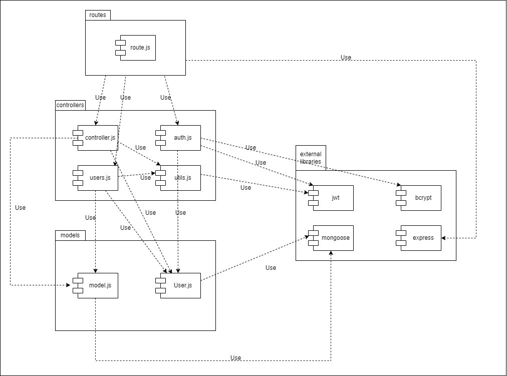
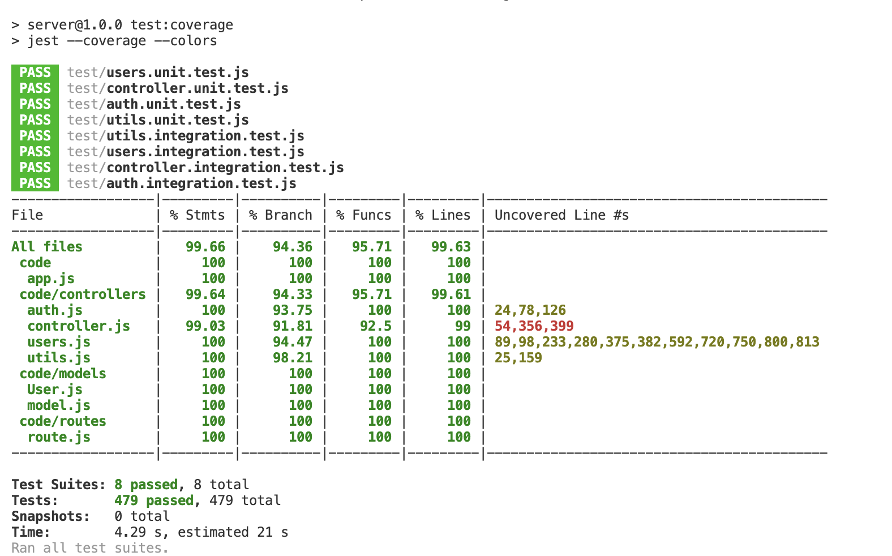

# Test Report

# Contents

- [Test Report](#test-report)
- [Contents](#contents)
- [Dependency graph](#dependency-graph)
- [Integration approach](#integration-approach)
- [Tests](#tests)
- [Coverage](#coverage)
  - [Coverage of FR](#coverage-of-fr)
  - [Coverage white box](#coverage-white-box)

# Dependency graph

# Integration approach

The integration approach chosen was "Bottom-up". Initially, the focus was on integrating the lower-level modules and their associated functions, followed by the integration of more complex modules. As a result, priority was given to testing and developing functions related to authentication, such as the "verifyAuth" function in the "utils.js" module, as well as functions responsible for saving essential data (e.g., user, admin, transaction, category) in the database. Once the integration of each individual module was completed,integration tests were conducted on the APIs using the routes defined in the "Route.js" module.

Please find below an example demonstrating the adopted integration approach:

| Step | Integration Unit(s)                                           |
| ---- | ------------------------------------------------------------- |
| 1    | verifyAuth (unit testing)                                     |
| 2    | createCategory (unit testing)                                 |
| 3    | createCategory (integration testing)                          |
| 4    | deleteCategory (unit testing)                                 |
| 5    | deleteCategory (integration testing)                          |
| 6    | Integration tests on APIs using routes from "Route.js" module |

# Tests

| Test case name                       | Object(s) tested                                                                                    | Test level  | Technique used         |
| ------------------------------------ | --------------------------------------------------------------------------------------------------- | ----------- | ---------------------- |
| register T1                          | register                                                                                            | unit        | WB/ statement coverage |
| register T2                          | register                                                                                            | unit        | WB/ statement coverage |
| register T3                          | register                                                                                            | unit        | WB/ statement coverage |
| register T4                          | register                                                                                            | unit        | WB/ statement coverage |
| register T5                          | register                                                                                            | unit        | WB/ statement coverage |
| register T6                          | register                                                                                            | unit        | WB/ statement coverage |
|                                      |                                                                                                     |             |                        |
| register T1                          | register, User.findOne(), User.create()                                                             | integration | BB/ eq partitioning    |
| register T2                          | register, User.findOne()                                                                            | integration | BB/ eq partitioning    |
| register T3                          | register                                                                                            | integration | BB/ eq partitioning    |
| register T4                          | register                                                                                            | integration | BB/ eq partitioning    |
| register T5                          | register                                                                                            | integration | BB/ eq partitioning    |
|                                      |                                                                                                     |             |                        |
|                                      |                                                                                                     |             |                        |
|                                      |                                                                                                     |             |                        |
| login T1                             | login                                                                                               | unit        | WB/ statement coverage |
| login T2                             | login                                                                                               | unit        | WB/ statement coverage |
| login T3                             | login                                                                                               | unit        | WB/ statement coverage |
| login T4                             | login                                                                                               | unit        | WB/ statement coverage |
| login T5                             | login                                                                                               | unit        | WB/ statement coverage |
| login T6                             | login                                                                                               | unit        | WB/ statement coverage |
|                                      |                                                                                                     |             |                        |
| login T1                             | login                                                                                               | integration | BB/ eq partitioning    |
| login T2                             | login                                                                                               | integration | BB/ eq partitioning    |
| login T3                             | login, User.findOne()                                                                               | integration | BB/ eq partitioning    |
| login T4                             | login, User.findOne(), bcrypt.compare()                                                             | integration | BB/ eq partitioning    |
| login T5                             | login, User.findOne(), bcrypt.compare(), User.save(), jwt.sign()                                    | integration | BB/ eq partitioning    |
|                                      |                                                                                                     |             |                        |
|                                      |                                                                                                     |             |                        |
|                                      |                                                                                                     |             |                        |
| logout T1                            | logout                                                                                              | unit        | WB/ statement coverage |
| logout T2                            | logout                                                                                              | unit        | WB/ statement coverage |
| logout T3                            | logout                                                                                              | unit        | WB/ statement coverage |
| logout T4                            | logout                                                                                              | unit        | WB/ statement coverage |
|                                      |                                                                                                     |             |                        |
| logout T1                            | logout                                                                                              | integration | BB/ eq partitioning    |
| logout T2                            | logout, User.findOne()                                                                              | integration | BB/ eq partitioning    |
| logout T3                            | logout, User.findOne(), User.save()                                                                 | integration | BB/ eq partitioning    |
|                                      |                                                                                                     |             |                        |
|                                      |                                                                                                     |             |                        |
|                                      |                                                                                                     |             |                        |
| registerAdmin T1                     | registerAdmin                                                                                       | unit        | WB/ statement coverage |
| registerAdmin T2                     | registerAdmin                                                                                       | unit        | WB/ statement coverage |
| registerAdmin T3                     | registerAdmin                                                                                       | unit        | WB/ statement coverage |
| registerAdmin T4                     | registerAdmin                                                                                       | unit        | WB/ statement coverage |
| registerAdmin T5                     | registerAdmin                                                                                       | unit        | WB/ statement coverage |
| registerAdmin T6                     | registerAdmin                                                                                       | unit        | WB/ statement coverage |
|                                      |                                                                                                     |             |                        |
| registerAdmin T1                     | registerAdmin, User.findOne(), User.create()                                                        | integration | BB/ eq partitioning    |
| registerAdmin T2                     | registerAdmin, User.findOne()                                                                       | integration | BB/ eq partitioning    |
| registerAdmin T3                     | registerAdmin                                                                                       | integration | BB/ eq partitioning    |
| registerAdmin T4                     | registerAdmin                                                                                       | integration | BB/ eq partitioning    |
| registerAdmin T5                     | registerAdmin                                                                                       | integration | BB/ eq partitioning    |
|                                      |                                                                                                     |             |                        |
|                                      |                                                                                                     |             |                        |
|                                      |                                                                                                     |             |                        |
| getUsers T1                          | getUsers                                                                                            | unit        | WB/ statement coverage |
| getUsers T2                          | getUsers                                                                                            | unit        | WB/ statement coverage |
| getUsers T3                          | getUsers                                                                                            | unit        | WB/ statement coverage |
|                                      |                                                                                                     |             |                        |
| getUsers T1                          | getUsers, verifyAuth()                                                                              | integration | BB/ eq partitioning    |
| getUsers T2                          | getUsers, verifyAuth(), User.find()                                                                 | integration | BB/ eq partitioning    |
|                                      |                                                                                                     |             |                        |
|                                      |                                                                                                     |             |                        |
|                                      |                                                                                                     |             |                        |
| getUser T1                           | getUser                                                                                             | unit        | WB/ statement coverage |
| getUser T2                           | getUser                                                                                             | unit        | WB/ statement coverage |
| getUser T3                           | getUser                                                                                             | unit        | WB/ statement coverage |
| getUser T4                           | getUser                                                                                             | unit        | WB/ statement coverage |
| getUser T5                           | getUser                                                                                             | unit        | WB/ statement coverage |
| getUser T6                           | getUser                                                                                             | unit        | WB/ statement coverage |
|                                      |                                                                                                     |             |                        |
| getUser T1                           | getUser, verifyAuth()                                                                               | integration | BB/ eq partitioning    |
| getUser T2                           | getUser, verifyAuth(), User.findOne()                                                               | integration | BB/ eq partitioning    |
| getUser T3                           | getUser, verifyAuth(), User.findOne()                                                               | integration | BB/ eq partitioning    |
| getUser T4                           | getUser, verifyAuth(), User.findOne()                                                               | integration | BB/ eq partitioning    |
| getUser T5                           | getUser, verifyAuth(), User.findOne()                                                               | integration | BB/ eq partitioning    |
|                                      |                                                                                                     |             |                        |
|                                      |                                                                                                     |             |                        |
|                                      |                                                                                                     |             |                        |
| deleteUser T1                        | deleteUser                                                                                          | unit        | WB/ statement coverage |
| deleteUser T2.1.1                    | deleteUser                                                                                          | unit        | WB/ statement coverage |
| deleteUser T2.1.2                    | deleteUser                                                                                          | unit        | WB/ statement coverage |
| deleteUser T2.1.3                    | deleteUser                                                                                          | unit        | WB/ statement coverage |
| deleteUser T2.2                      | deleteUser                                                                                          | unit        | WB/ statement coverage |
| deleteUser T2.3.1                    | deleteUser                                                                                          | unit        | WB/ statement coverage |
| deleteUser T2.3.2                    | deleteUser                                                                                          | unit        | WB/ statement coverage |
| deleteUser T2.3.3                    | deleteUser                                                                                          | unit        | WB/ statement coverage |
| deleteUser T3                        | deleteUser                                                                                          | unit        | WB/ statement coverage |
|                                      |                                                                                                     |             |                        |
| deleteUser T1                        | deleteUser, verifyAuth()                                                                            | integration | BB/ eq partitioning    |
| deleteUser T2.1.1                    | deleteUser, verifyAuth()                                                                            | integration | BB/ eq partitioning    |
| deleteUser T2.1.2                    | deleteUser, verifyAuth()                                                                            | integration | BB/ eq partitioning    |
| deleteUser T2.1.3                    | deleteUser, verifyAuth()                                                                            | integration | BB/ eq partitioning    |
| deleteUser T2.2                      | deleteUser, verifyAuth(), User.findOne()                                                            | integration | BB/ eq partitioning    |
| deleteUser T2.3.1                    | deleteUser, verifyAuth(), User.findOne()                                                            | integration | BB/ eq partitioning    |
| deleteUser T2.3.2                    | deleteUser, verifyAuth(), User.findOne(), transactions.deleteMany(), Group.findOne(),               | integration | BB/ eq partitioning    |
|                                      | Group.deleteOne(), User.deleteOne()                                                                 |             |                        |
| deleteUser T2.3.3                    | deleteUser, verifyAuth(), User.findOne(), transactions.deleteMany(), Group.findOne(),               | integration | BB/ eq partitioning    |
|                                      | Group.findOneAndUpdate(), User.deleteOne()                                                          |             |                        |
|                                      |                                                                                                     |             |                        |
|                                      |                                                                                                     |             |                        |
|                                      |                                                                                                     |             |                        |
| createGroup T1                       | createGroup                                                                                         | unit        | WB/ statement coverage |
| createGroup T2.1.1                   | createGroup                                                                                         | unit        | WB/ statement coverage |
| createGroup T2.1.2                   | createGroup                                                                                         | unit        | WB/ statement coverage |
| createGroup T2.1.3                   | createGroup                                                                                         | unit        | WB/ statement coverage |
| createGroup T2.2.1                   | createGroup                                                                                         | unit        | WB/ statement coverage |
| createGroup T2.2.2                   | createGroup                                                                                         | unit        | WB/ statement coverage |
| createGroup T2.3.1                   | createGroup                                                                                         | unit        | WB/ statement coverage |
| createGroup T2.3.2                   | createGroup                                                                                         | unit        | WB/ statement coverage |
| createGroup T2.4.1                   | createGroup                                                                                         | unit        | WB/ statement coverage |
| createGroup T2.4.2                   | createGroup                                                                                         | unit        | WB/ statement coverage |
| createGroup T2.4.3                   | createGroup                                                                                         | unit        | WB/ statement coverage |
| createGroup T2.4.4                   | createGroup                                                                                         | unit        | WB/ statement coverage |
| createGroup T2.4.5                   | createGroup                                                                                         | unit        | WB/ statement coverage |
|                                      |                                                                                                     |             |                        |
| createGroup T1                       | createGroup, verifyAuth()                                                                           | integration | BB/ eq partitioning    |
| createGroup T2.1.1                   | createGroup, verifyAuth()                                                                           | integration | BB/ eq partitioning    |
| createGroup T2.1.2                   | createGroup, verifyAuth()                                                                           | integration | BB/ eq partitioning    |
| createGroup T2.1.3                   | createGroup, verifyAuth()                                                                           | integration | BB/ eq partitioning    |
| createGroup T2.2.1                   | createGroup, verifyAuth()                                                                           | integration | BB/ eq partitioning    |
| createGroup T2.2.2                   | createGroup, verifyAuth(), Group.findOne(), User.findOne()                                          | integration | BB/ eq partitioning    |
| createGroup T2.3.1                   | createGroup, verifyAuth(), Group.findOne(), User.findOne()                                          | integration | BB/ eq partitioning    |
| createGroup T2.3.2                   | createGroup, verifyAuth(), Group.findOne(), User.findOne()                                          | integration | BB/ eq partitioning    |
| createGroup T2.4.1                   | createGroup, verifyAuth(), Group.findOne(), User.findOne()                                          | integration | BB/ eq partitioning    |
| createGroup T2.4.2                   | createGroup, verifyAuth(), Group.findOne(), User.findOne()                                          | integration | BB/ eq partitioning    |
| createGroup T2.4.3                   | createGroup, verifyAuth(), Group.findOne(), User.findOne(), Group.create()                          | integration | BB/ eq partitioning    |
| createGroup T2.4.4                   | createGroup, verifyAuth(), Group.findOne(), User.findOne(), Group.create()                          | integration | BB/ eq partitioning    |
|                                      |                                                                                                     |             |                        |
|                                      |                                                                                                     |             |                        |
|                                      |                                                                                                     |             |                        |
| getGroups T1                         | getGroups                                                                                           | unit        | WB/ statement coverage |
| getGroups T2                         | getGroups                                                                                           | unit        | WB/ statement coverage |
| getGroups T3                         | getGroups                                                                                           | unit        | WB/ statement coverage |
|                                      |                                                                                                     |             |                        |
| getGroups T1                         | getGroups, verifyAuth()                                                                             | integration | BB/ eq partitioning    |
| getGroups T2                         | getGroups, verifyAuth(), Group.find()                                                               | integration | BB/ eq partitioning    |
|                                      |                                                                                                     |             |                        |
|                                      |                                                                                                     |             |                        |
|                                      |                                                                                                     |             |                        |
| getGroup T1                          | getGroup                                                                                            | unit        | WB/ statement coverage |
| getGroup T2.1                        | getGroup                                                                                            | unit        | WB/ statement coverage |
| getGroup T2.2                        | getGroup                                                                                            | unit        | WB/ statement coverage |
| getGroup T2.3                        | getGroup                                                                                            | unit        | WB/ statement coverage |
| getGroup T3                          | getGroup                                                                                            | unit        | WB/ statement coverage |
|                                      |                                                                                                     |             |                        |
| getGroup T1                          | getGroup, Group.findOne()                                                                           | integration | BB/ eq partitioning    |
| getGroup T2.1                        | getGroup, Group.findOne(), verifyAuth()                                                             | integration | BB/ eq partitioning    |
| getGroup T2.2                        | getGroup, Group.findOne(), verifyAuth()                                                             | integration | BB/ eq partitioning    |
| getGroup T2.3                        | getGroup, Group.findOne(), verifyAuth()                                                             | integration | BB/ eq partitioning    |
|                                      |                                                                                                     |             |                        |
|                                      |                                                                                                     |             |                        |
|                                      |                                                                                                     |             |                        |
| addToGroup T1.1                      | addToGroup                                                                                          | unit        | WB/ statement coverage |
| addToGroup T1.2                      | addToGroup                                                                                          | unit        | WB/ statement coverage |
| addToGroup T1.3.1                    | addToGroup                                                                                          | unit        | WB/ statement coverage |
| addToGroup T1.3.2                    | addToGroup                                                                                          | unit        | WB/ statement coverage |
| addToGroup T1.4                      | addToGroup                                                                                          | unit        | WB/ statement coverage |
| addToGroup T1.5                      | addToGroup                                                                                          | unit        | WB/ statement coverage |
| addToGroup T1.6.1                    | addToGroup                                                                                          | unit        | WB/ statement coverage |
| addToGroup T1.6.2                    | addToGroup                                                                                          | unit        | WB/ statement coverage |
| addToGroup T1.7.1                    | addToGroup                                                                                          | unit        | WB/ statement coverage |
| addToGroup T1.7.2                    | addToGroup                                                                                          | unit        | WB/ statement coverage |
| addToGroup T2.1                      | addToGroup                                                                                          | unit        | WB/ statement coverage |
| addToGroup T2.2                      | addToGroup                                                                                          | unit        | WB/ statement coverage |
| addToGroup T2.3.1                    | addToGroup                                                                                          | unit        | WB/ statement coverage |
| addToGroup T2.3.2                    | addToGroup                                                                                          | unit        | WB/ statement coverage |
| addToGroup T2.4                      | addToGroup                                                                                          | unit        | WB/ statement coverage |
| addToGroup T2.5                      | addToGroup                                                                                          | unit        | WB/ statement coverage |
| addToGroup T2.6.1                    | addToGroup                                                                                          | unit        | WB/ statement coverage |
| addToGroup T2.6.2                    | addToGroup                                                                                          | unit        | WB/ statement coverage |
| addToGroup T2.7.1                    | addToGroup                                                                                          | unit        | WB/ statement coverage |
| addToGroup T2.7.2                    | addToGroup                                                                                          | unit        | WB/ statement coverage |
| addToGroup T3                        | addToGroup                                                                                          | unit        | WB/ statement coverage |
|                                      |                                                                                                     |             |                        |
| addToGroup T1.1                      | addToGroup, Group.findOne()                                                                         | integration | BB/ eq partitioning    |
| addToGroup T1.2                      | addToGroup, Group.findOne(), verifyAuth()                                                           | integration | BB/ eq partitioning    |
| addToGroup T1.3.1                    | addToGroup, Group.findOne(), verifyAuth()                                                           | integration | BB/ eq partitioning    |
| addToGroup T1.3.2                    | addToGroup, Group.findOne(), verifyAuth()                                                           | integration | BB/ eq partitioning    |
| addToGroup T1.4                      | addToGroup, Group.findOne(), verifyAuth()                                                           | integration | BB/ eq partitioning    |
| addToGroup T1.5                      | addToGroup, Group.findOne(), verifyAuth()                                                           | integration | BB/ eq partitioning    |
| addToGroup T1.6.1                    | addToGroup, Group.findOne(), verifyAuth(), User.findOne()                                           | integration | BB/ eq partitioning    |
| addToGroup T1.6.2                    | addToGroup, Group.findOne(), verifyAuth(), User.findOne()                                           | integration | BB/ eq partitioning    |
| addToGroup T1.7.1                    | addToGroup, Group.findOne(), verifyAuth(), User.findOne(), Group.findOneAndUpdate()                 | integration | BB/ eq partitioning    |
| addToGroup T1.7.2                    | addToGroup, Group.findOne(), verifyAuth(), User.findOne(), Group.findOneAndUpdate()                 | integration | BB/ eq partitioning    |
| addToGroup T2.1                      | addToGroup, verifyAuth()                                                                            | integration | BB/ eq partitioning    |
| addToGroup T2.2                      | addToGroup, verifyAuth(), Group.findOne()                                                           | integration | BB/ eq partitioning    |
| addToGroup T2.3.1                    | addToGroup, verifyAuth(), Group.findOne()                                                           | integration | BB/ eq partitioning    |
| addToGroup T2.3.2                    | addToGroup, verifyAuth(), Group.findOne()                                                           | integration | BB/ eq partitioning    |
| addToGroup T2.4                      | addToGroup, verifyAuth(), Group.findOne()                                                           | integration | BB/ eq partitioning    |
| addToGroup T2.5                      | addToGroup, verifyAuth(), Group.findOne()                                                           | integration | BB/ eq partitioning    |
| addToGroup T2.6.1                    | addToGroup, Group.findOne(), verifyAuth(), User.findOne()                                           | integration | BB/ eq partitioning    |
| addToGroup T2.6.2                    | addToGroup, Group.findOne(), verifyAuth(), User.findOne()                                           | integration | BB/ eq partitioning    |
| addToGroup T2.7.1                    | addToGroup, Group.findOne(), verifyAuth(), User.findOne(), Group.findOneAndUpdate()                 | integration | BB/ eq partitioning    |
| addToGroup T2.7.2                    | addToGroup, Group.findOne(), verifyAuth(), User.findOne(), Group.findOneAndUpdate()                 | integration | BB/ eq partitioning    |
|                                      |                                                                                                     |             |                        |
|                                      |                                                                                                     |             |                        |
|                                      |                                                                                                     |             |                        |
| removeFromGroup T1.1.1               | removeFromGroup                                                                                     | unit        | WB/ statement coverage |
| removeFromGroup T1.1.2               | removeFromGroup                                                                                     | unit        | WB/ statement coverage |
| removeFromGroup T1.1.3               | removeFromGroup                                                                                     | unit        | WB/ statement coverage |
| removeFromGroup T1.2                 | removeFromGroup                                                                                     | unit        | WB/ statement coverage |
| removeFromGroup T1.3                 | removeFromGroup                                                                                     | unit        | WB/ statement coverage |
| removeFromGroup T1.4                 | removeFromGroup                                                                                     | unit        | WB/ statement coverage |
| removeFromGroup T1.5                 | removeFromGroup                                                                                     | unit        | WB/ statement coverage |
| removeFromGroup T1.6                 | removeFromGroup                                                                                     | unit        | WB/ statement coverage |
| removeFromGroup T1.7.1               | removeFromGroup                                                                                     | unit        | WB/ statement coverage |
| removeFromGroup T1.7.2               | removeFromGroup                                                                                     | unit        | WB/ statement coverage |
| removeFromGroup T1.8.1               | removeFromGroup                                                                                     | unit        | WB/ statement coverage |
| removeFromGroup T1.8.2               | removeFromGroup                                                                                     | unit        | WB/ statement coverage |
| removeFromGroup T2.1                 | removeFromGroup                                                                                     | unit        | WB/ statement coverage |
| removeFromGroup T2.2.1               | removeFromGroup                                                                                     | unit        | WB/ statement coverage |
| removeFromGroup T2.2.2               | removeFromGroup                                                                                     | unit        | WB/ statement coverage |
| removeFromGroup T2.2.3               | removeFromGroup                                                                                     | unit        | WB/ statement coverage |
| removeFromGroup T2.3                 | removeFromGroup                                                                                     | unit        | WB/ statement coverage |
| removeFromGroup T2.5                 | removeFromGroup                                                                                     | unit        | WB/ statement coverage |
| removeFromGroup T2.6                 | removeFromGroup                                                                                     | unit        | WB/ statement coverage |
| removeFromGroup T2.7.1               | removeFromGroup                                                                                     | unit        | WB/ statement coverage |
| removeFromGroup T2.7.2               | removeFromGroup                                                                                     | unit        | WB/ statement coverage |
| removeFromGroup T2.8.1               | removeFromGroup                                                                                     | unit        | WB/ statement coverage |
| removeFromGroup T2.8.2               | removeFromGroup                                                                                     | unit        | WB/ statement coverage |
| removeFromGroup T3                   | removeFromGroup                                                                                     | unit        | WB/ statement coverage |
|                                      |                                                                                                     |             |                        |
| removeFromGroup T1.1.2               | verifyAuth(), Group.findOne()                                                                       | integration | BB/ eq partitioning    |
| removeFromGroup T1.1.3               | verifyAuth(), Group.findOne()                                                                       | integration | BB/ eq partitioning    |
| removeFromGroup T1.2                 | Group.findOne()                                                                                     | integration | BB/ eq partitioning    |
| removeFromGroup T1.3                 | verifyAuth(), Group.findOne()                                                                       | integration | BB/ eq partitioning    |
| removeFromGroup T1.4                 | verifyAuth(), Group.findOne()                                                                       | integration | BB/ eq partitioning    |
| removeFromGroup T1.5                 | verifyAuth(), Group.findOne()                                                                       | integration | BB/ eq partitioning    |
| removeFromGroup T1.6                 | verifyAuth(), Group.findOne()                                                                       | integration | BB/ eq partitioning    |
| removeFromGroup T1.7.1               | verifyAuth(), Group.findOne(), User.findOne()                                                       | integration | BB/ eq partitioning    |
| removeFromGroup T1.7.2               | verifyAuth(), Group.findOne(), User.findOne()                                                       | integration | BB/ eq partitioning    |
| removeFromGroup T1.8.1               | verifyAuth(), Group.findOne(), User.findOne(), Group.findOneAndUpdate()                             | integration | BB/ eq partitioning    |
| removeFromGroup T1.8.2               | verifyAuth(), Group.findOne(), User.findOne(), Group.findOneAndUpdate()                             | integration | BB/ eq partitioning    |
| removeFromGroup T2.1                 | verifyAuth()                                                                                        | integration | BB/ eq partitioning    |
| removeFromGroup T2.2.2               | verifyAuth()                                                                                        | integration | BB/ eq partitioning    |
| removeFromGroup T2.2.3               | verifyAuth()                                                                                        | integration | BB/ eq partitioning    |
| removeFromGroup T2.3                 | verifyAuth(), Group.findOne()                                                                       | integration | BB/ eq partitioning    |
| removeFromGroup T2.4                 | verifyAuth(), Group.findOne()                                                                       | integration | BB/ eq partitioning    |
| removeFromGroup T2.5                 | verifyAuth(), Group.findOne()                                                                       | integration | BB/ eq partitioning    |
| removeFromGroup T2.6                 | verifyAuth(), Group.findOne()                                                                       | integration | BB/ eq partitioning    |
| removeFromGroup T2.7.1               | verifyAuth(), Group.findOne(), User.findOne()                                                       | integration | BB/ eq partitioning    |
| removeFromGroup T2.7.2               | verifyAuth(), Group.findOne(), User.findOne()                                                       | integration | BB/ eq partitioning    |
| removeFromGroup T2.8.1               | verifyAuth(), Group.findOne(), User.findOne(), Group.findOneAndUpdate()                             | integration | BB/ eq partitioning    |
| removeFromGroup T2.8.2               | verifyAuth(), Group.findOne(), User.findOne(), Group.findOneAndUpdate()                             | integration | BB/ eq partitioning    |
|                                      |                                                                                                     |             |                        |
|                                      |                                                                                                     |             |                        |
|                                      |                                                                                                     |             |                        |
| deleteGroup T1                       | deleteGroup                                                                                         | unit        | WB/ statement coverage |
| deleteGroup T2.1                     | deleteGroup                                                                                         | unit        | WB/ statement coverage |
| deleteGroup T2.2                     | deleteGroup                                                                                         | unit        | WB/ statement coverage |
| deleteGroup T2.3                     | deleteGroup                                                                                         | unit        | WB/ statement coverage |
| deleteGroup T2.4                     | deleteGroup                                                                                         | unit        | WB/ statement coverage |
| deleteGroup T3                       | deleteGroup                                                                                         | unit        | WB/ statement coverage |
|                                      |                                                                                                     |             |                        |
| deleteGroup T1                       | deleteGroup, verifyAuth()                                                                           | integration | BB/ eq partitioning    |
| deleteGroup T2.1                     | deleteGroup, verifyAuth()                                                                           | integration | BB/ eq partitioning    |
| deleteGroup T2.2                     | deleteGroup, verifyAuth()                                                                           | integration | BB/ eq partitioning    |
| deleteGroup T2.3                     | deleteGroup, verifyAuth(), Group.findOne()                                                          | integration | BB/ eq partitioning    |
| deleteGroup T2.4                     | deleteGroup, verifyAuth(), Group.findOne(), Group.deleteOne()                                       | integration | BB/ eq partitioning    |
|                                      |                                                                                                     |             |                        |
|                                      |                                                                                                     |             |                        |
|                                      |                                                                                                     |             |                        |
| createTransaction T1                 | createTransaction                                                                                   | unit        | WB/ statement coverage |
| createTransaction T2.1.1             | createTransaction                                                                                   | unit        | WB/ statement coverage |
| createTransaction T2.1.2             | createTransaction                                                                                   | unit        | WB/ statement coverage |
| createTransaction T2.2.1             | createTransaction                                                                                   | unit        | WB/ statement coverage |
| createTransaction T2.2.2             | createTransaction                                                                                   | unit        | WB/ statement coverage |
| createTransaction T2.3.1             | createTransaction                                                                                   | unit        | WB/ statement coverage |
| createTransaction T2.3.2             | createTransaction                                                                                   | unit        | WB/ statement coverage |
| createTransaction T3.1               | createTransaction                                                                                   | unit        | WB/ statement coverage |
| createTransaction T3.2               | createTransaction                                                                                   | unit        | WB/ statement coverage |
| createTransaction T3.3               | createTransaction                                                                                   | unit        | WB/ statement coverage |
| createTransaction T3.4               | createTransaction                                                                                   | unit        | WB/ statement coverage |
| createTransaction T3.5               | createTransaction                                                                                   | unit        | WB/ statement coverage |
| createTransaction T3.6               | createTransaction                                                                                   | unit        | WB/ statement coverage |
| createTransaction T4                 | createTransaction                                                                                   | unit        | WB/ statement coverage |
|                                      |                                                                                                     |             |                        |
| createTransaction T1                 | createTransaction, verifyAuth()                                                                     | integration | BB/ eq partitioning    |
| createTransaction T2.1.1             | createTransaction, verifyAuth()                                                                     | integration | BB/ eq partitioning    |
| createTransaction T2.1.2             | createTransaction, verifyAuth()                                                                     | integration | BB/ eq partitioning    |
| createTransaction T2.2.1             | createTransaction, verifyAuth()                                                                     | integration | BB/ eq partitioning    |
| createTransaction T2.2.2             | createTransaction, verifyAuth()                                                                     | integration | BB/ eq partitioning    |
| createTransaction T2.3.1             | createTransaction, verifyAuth()                                                                     | integration | BB/ eq partitioning    |
| createTransaction T2.3.2             | createTransaction, verifyAuth()                                                                     | integration | BB/ eq partitioning    |
| createTransaction T3.1               | createTransaction, verifyAuth(), categories.findOne()                                               | integration | BB/ eq partitioning    |
| createTransaction T3.2               | createTransaction, verifyAuth(), categories.findOne(), User.findOne()                               | integration | BB/ eq partitioning    |
| createTransaction T3.3               | createTransaction, verifyAuth(), categories.findOne(), User.findOne()                               | integration | BB/ eq partitioning    |
| createTransaction T3.4               | createTransaction, verifyAuth(), categories.findOne(), User.findOne()                               | integration | BB/ eq partitioning    |
| createTransaction T3.5               | createTransaction, verifyAuth(), categories.findOne(), User.findOne(), transactions.save()          | integration | BB/ eq partitioning    |
|                                      |                                                                                                     |             |                        |
|                                      |                                                                                                     |             |                        |
|                                      |                                                                                                     |             |                        |
| getAllTransactions T1                | getAllTransactions                                                                                  | unit        | WB/ statement coverage |
| getAllTransactions T2                | getAllTransactions                                                                                  | unit        | WB/ statement coverage |
| getAllTransactions T3                | getAllTransactions                                                                                  | unit        | WB/ statement coverage |
|                                      |                                                                                                     |             |                        |
| getAllTransactions T1                | getAllTransactions, verifyAuth()                                                                    | integration | BB/ eq partitioning    |
| getAllTransactions T2                | getAllTransactions, verifyAuth(), transactions.aggregate(), , Object.assign()                       | integration | BB/ eq partitioning    |
|                                      |                                                                                                     |             |                        |
|                                      |                                                                                                     |             |                        |
|                                      |                                                                                                     |             |                        |
| getTransactionsByUser T1.1           | getTransactionsByUser                                                                               | unit        | WB/ statement coverage |
| getTransactionsByUser T1.2.1         | getTransactionsByUser                                                                               | unit        | WB/ statement coverage |
| getTransactionsByUser T1.2.2         | getTransactionsByUser                                                                               | unit        | WB/ statement coverage |
| getTransactionsByUser T1.3           | getTransactionsByUser                                                                               | unit        | WB/ statement coverage |
| getTransactionsByUser T2.1           | getTransactionsByUser                                                                               | unit        | WB/ statement coverage |
| getTransactionsByUser T2.2.1         | getTransactionsByUser                                                                               | unit        | WB/ statement coverage |
| getTransactionsByUser T2.2.2         | getTransactionsByUser                                                                               | unit        | WB/ statement coverage |
| getTransactionsByUser T2.2.3         | getTransactionsByUser                                                                               | unit        | WB/ statement coverage |
| getTransactionsByUser T3             | getTransactionsByUser                                                                               | unit        | WB/ statement coverage |
|                                      |                                                                                                     |             |                        |
| getTransactionsByUser T1.1           | getTransactionsByUser, verifyAuth(), User.findOne()                                                 | integration | BB/ eq partitioning    |
| getTransactionsByUser T1.2.1         | getTransactionsByUser, verifyAuth(), User.findOne(), handleDateFilterParams(),                      | integration | BB/ eq partitioning    |
|                                      | handleAmountFilterParams(), transactions.aggregate()                                                |             |                        |
| getTransactionsByUser T1.2.2         | getTransactionsByUser, verifyAuth(), User.findOne(),                                                | integration | BB/ eq partitioning    |
|                                      | handleAmountFilterParams(), transactions.aggregate(), Object.assign()                               |             |                        |
| getTransactionsByUser T1.3           | getTransactionsByUser, verifyAuth(), User.findOne()                                                 | integration | BB/ eq partitioning    |
| getTransactionsByUser T2.1           | getTransactionsByUser, verifyAuth()                                                                 | integration | BB/ eq partitioning    |
| getTransactionsByUser T2.2.1         | getTransactionsByUser, verifyAuth(), User.findOne()                                                 | integration | BB/ eq partitioning    |
| getTransactionsByUser T2.2.2         | getTransactionsByUser, verifyAuth(), User.findOne(), transactions.aggregate()                       | integration | BB/ eq partitioning    |
| getTransactionsByUser T2.2.3         | getTransactionsByUser, verifyAuth(), User.findOne(), transactions.aggregate(), Object.assign()      | integration | BB/ eq partitioning    |
|                                      |                                                                                                     |             |                        |
|                                      |                                                                                                     |             |                        |
|                                      |                                                                                                     |             |                        |
| getTransactionsByUserByCategory T1   | getTransactionsByUserByCategory                                                                     | unit        | WB/ statement coverage |
| getTransactionsByUserByCategory T2   | getTransactionsByUserByCategory                                                                     | unit        | WB/ statement coverage |
| getTransactionsByUserByCategory T3   | getTransactionsByUserByCategory                                                                     | unit        | WB/ statement coverage |
| getTransactionsByUserByCategory T4   | getTransactionsByUserByCategory                                                                     | unit        | WB/ statement coverage |
| getTransactionsByUserByCategory T5.1 | getTransactionsByUserByCategory                                                                     | unit        | WB/ statement coverage |
| getTransactionsByUserByCategory T5.2 | getTransactionsByUserByCategory                                                                     | unit        | WB/ statement coverage |
| getTransactionsByUserByCategory T6   | getTransactionsByUserByCategory                                                                     | unit        | WB/ statement coverage |
| getTransactionsByUserByCategory T7   | getTransactionsByUserByCategory                                                                     | unit        | WB/ statement coverage |
| getTransactionsByUserByCategory T8   | getTransactionsByUserByCategory                                                                     | unit        | WB/ statement coverage |
| getTransactionsByUserByCategory T9.1 | getTransactionsByUserByCategory                                                                     | unit        | WB/ statement coverage |
| getTransactionsByUserByCategory T9.2 | getTransactionsByUserByCategory                                                                     | unit        | WB/ statement coverage |
| getTransactionsByUserByCategory T10  | getTransactionsByUserByCategory                                                                     | unit        | WB/ statement coverage |
|                                      |                                                                                                     |             |                        |
| getTransactionsByUserByCategory T1   | getTransactionsByUserByCategory, verifyAuth()                                                       | integration | BB/ eq partitioning    |
| getTransactionsByUserByCategory T2   | getTransactionsByUserByCategory, verifyAuth()                                                       | integration | BB/ eq partitioning    |
| getTransactionsByUserByCategory T3   | getTransactionsByUserByCategory, verifyAuth(), User.findOne()                                       | integration | BB/ eq partitioning    |
| getTransactionsByUserByCategory T4   | getTransactionsByUserByCategory, verifyAuth(), categories.findOne(),User.findOne()                  | integration | BB/ eq partitioning    |
| getTransactionsByUserByCategory T5.1 | getTransactionsByUserByCategory, verifyAuth(), User.findOne(), categories.findOne(),                | integration | BB/ eq partitioning    |
|                                      | transactions.aggregate()                                                                            |
| getTransactionsByUserByCategory T5.2 | getTransactionsByUserByCategory, verifyAuth(), User.findOne(), categories.findOne(),                | integration | BB/ eq partitioning    |
|                                      | transactions.aggregate()                                                                            |
| getTransactionsByUserByCategory T6   | getTransactionsByUserByCategory, verifyAuth(), User.findOne()                                       | integration | BB/ eq partitioning    |
| getTransactionsByUserByCategory T7   | getTransactionsByUserByCategory, verifyAuth(), User.findOne(), categories.findOne()                 | integration | BB/ eq partitioning    |
| getTransactionsByUserByCategory T8   | getTransactionsByUserByCategory, verifyAuth(), User.findOne(), categories.findOne(),                | integration | BB/ eq partitioning    |
|                                      | transactions.aggregate()                                                                            |             |                        |
| getTransactionsByUserByCategory T9.1 | getTransactionsByUserByCategory                                                                     | integration | BB/ eq partitioning    |
| getTransactionsByUserByCategory T9.2 | getTransactionsByUserByCategory, verifyAuth(), User.findOne(), categories.findOne(),                | integration | BB/ eq partitioning    |
|                                      | transactions.aggregate()                                                                            |             |                        |
|                                      |                                                                                                     |             |                        |
|                                      |                                                                                                     |             |                        |
|                                      |                                                                                                     |             |                        |
| getTransactionsByGroup T1            | getTransactionsByGroup                                                                              | unit        | WB/ statement coverage |
| getTransactionsByGroup T2            | getTransactionsByGroup                                                                              | unit        | WB/ statement coverage |
| getTransactionsByGroup T3            | getTransactionsByGroup                                                                              | unit        | WB/ statement coverage |
| getTransactionsByGroup T4            | getTransactionsByGroup                                                                              | unit        | WB/ statement coverage |
| getTransactionsByGroup T5            | getTransactionsByGroup                                                                              | unit        | WB/ statement coverage |
| getTransactionsByGroup T6            | getTransactionsByGroup                                                                              | unit        | WB/ statement coverage |
|                                      |                                                                                                     |             |                        |
| getTransactionsByGroup T1            | getTransactionsByGroup, Group.findOne()                                                             | integration | BB/ eq partitioning    |
| getTransactionsByGroup T2            | getTransactionsByGroup, verifyAuth(), Group.findOne()                                               | integration | BB/ eq partitioning    |
| getTransactionsByGroup T3            | getTransactionsByGroup, verifyAuth(), Group.findOne()                                               | integration | BB/ eq partitioning    |
| getTransactionsByGroup T4            | getTransactionsByGroup, verifyAuth(), Group.findOne(),                                              | integration | BB/ eq partitioning    |
|                                      | transactions.aggregate()                                                                            |             |                        |
| getTransactionsByGroup T5            | getTransactionsByGroup, verifyAuth(), Group.findOne(),                                              | integration | BB/ eq partitioning    |
|                                      | transactions.aggregate()                                                                            |             |                        |
|                                      |                                                                                                     |             |                        |
|                                      |                                                                                                     |             |                        |
|                                      |                                                                                                     |             |                        |
| getTransactionsByGroupByCategory T1  | getTransactionsByGroupByCategory                                                                    | unit        | WB/ statement coverage |
| getTransactionsByGroupByCategory T2  | getTransactionsByGroupByCategory                                                                    | unit        | WB/ statement coverage |
| getTransactionsByGroupByCategory T3  | getTransactionsByGroupByCategory                                                                    | unit        | WB/ statement coverage |
| getTransactionsByGroupByCategory T4  | getTransactionsByGroupByCategory                                                                    | unit        | WB/ statement coverage |
| getTransactionsByGroupByCategory T5  | getTransactionsByGroupByCategory                                                                    | unit        | WB/ statement coverage |
| getTransactionsByGroupByCategory T6  | getTransactionsByGroupByCategory                                                                    | unit        | WB/ statement coverage |
| getTransactionsByGroupByCategory T7  | getTransactionsByGroupByCategory                                                                    | unit        | WB/ statement coverage |
| getTransactionsByGroupByCategory T8  | getTransactionsByGroupByCategory                                                                    | unit        | WB/ statement coverage |
|                                      |                                                                                                     |             |                        |
| getTransactionsByGroupByCategory T1  | getTransactionsByGroupByCategory, Group.findOne()                                                   | integration | BB/ eq partitioning    |
| getTransactionsByGroupByCategory T2  | getTransactionsByGroupByCategory, Group.findOne(), verifyAuth()                                     | integration | BB/ eq partitioning    |
| getTransactionsByGroupByCategory T3  | getTransactionsByGroupByCategory, Group.findOne(), verifyAuth()                                     | integration | BB/ eq partitioning    |
| getTransactionsByGroupByCategory T4  | getTransactionsByGroupByCategory, Group.findOne(), verifyAuth(), categories.findOne()               | integration | BB/ eq partitioning    |
| getTransactionsByGroupByCategory T5  | getTransactionsByGroupByCategory, Group.findOne(), verifyAuth(), categories.findOne(),              | integration | BB/ eq partitioning    |
|                                      | transactions.aggregate()                                                                            |             |                        |
| getTransactionsByGroupByCategory T6  | getTransactionsByGroupByCategory, Group.findOne(), verifyAuth(), categories.findOne()               | integration | BB/ eq partitioning    |
| getTransactionsByGroupByCategory T7  | getTransactionsByGroupByCategory, Group.findOne(), verifyAuth(), categories.findOne()               | integration | BB/ eq partitioning    |
|                                      | transactions.aggregate()                                                                            |             |                        |
|                                      |                                                                                                     |             |                        |
|                                      |                                                                                                     |             |                        |
|                                      |                                                                                                     |             |                        |
| deleteTransaction T1                 | deleteTransaction                                                                                   | unit        | WB/ statement coverage |
| deleteTransaction T2.1.1             | deleteTransaction                                                                                   | unit        | WB/ statement coverage |
| deleteTransaction T2.1.2             | deleteTransaction                                                                                   | unit        | WB/ statement coverage |
| deleteTransaction T2.2.1             | deleteTransaction                                                                                   | unit        | WB/ statement coverage |
| deleteTransaction T2.2.2             | deleteTransaction                                                                                   | unit        | WB/ statement coverage |
| deleteTransaction T2.3.1             | deleteTransaction                                                                                   | unit        | WB/ statement coverage |
| deleteTransaction T2.3.2             | deleteTransaction                                                                                   | unit        | WB/ statement coverage |
| deleteTransaction T2.3.3             | deleteTransaction                                                                                   | unit        | WB/ statement coverage |
| deleteTransaction T2.4               | deleteTransaction                                                                                   | unit        | WB/ statement coverage |
|                                      |                                                                                                     |             |                        |
| deleteTransaction T1                 | deleteTransaction, verifyAuth()                                                                     | integration | BB/ eq partitioning    |
| deleteTransaction T2.1.1             | deleteTransaction, verifyAuth()                                                                     | integration | BB/ eq partitioning    |
| deleteTransaction T2.1.2             | deleteTransaction, verifyAuth()                                                                     | integration | BB/ eq partitioning    |
| deleteTransaction T2.2.1             | deleteTransaction, verifyAuth(), User.findOne()                                                     | integration | BB/ eq partitioning    |
| deleteTransaction T2.2.2             | deleteTransaction, verifyAuth(), User.findOne(), transactions.findOne()                             | integration | BB/ eq partitioning    |
| deleteTransaction T2.3.1             | deleteTransaction, verifyAuth(), User.findOne(), transactions.findOne()                             | integration | BB/ eq partitioning    |
| deleteTransaction T2.3.2             | deleteTransaction, verifyAuth(), User.findOne(), transactions.findOne()                             | integration | BB/ eq partitioning    |
| deleteTransaction T2.3.3             | deleteTransaction, verifyAuth(), User.findOne(), transactions.findOne()                             | integration | BB/ eq partitioning    |
| deleteTransaction T2.3.4             | deleteTransaction, verifyAuth(), User.findOne(), transactions.findOne(), transactions.deleteOne()   | integration | BB/ eq partitioning    |
|                                      |                                                                                                     |             |                        |
|                                      |                                                                                                     |             |                        |
|                                      |                                                                                                     |             |                        |
| deleteTransactions T1                | deleteTransactions                                                                                  | unit        | WB/ statement coverage |
| deleteTransactions T2.1.1            | deleteTransactions                                                                                  | unit        | WB/ statement coverage |
| deleteTransactions T2.1.2            | deleteTransactions                                                                                  | unit        | WB/ statement coverage |
| deleteTransactions T2.1.3            | deleteTransactions                                                                                  | unit        | WB/ statement coverage |
| deleteTransactions T2.1.4            | deleteTransactions                                                                                  | unit        | WB/ statement coverage |
| deleteTransactions T2.2.1            | deleteTransactions                                                                                  | unit        | WB/ statement coverage |
| deleteTransactions T2.2.2            | deleteTransactions                                                                                  | unit        | WB/ statement coverage |
| deleteTransactions T2.3              | deleteTransactions                                                                                  | unit        | WB/ statement coverage |
|                                      |                                                                                                     |             |                        |
| deleteTransactions T1                | deleteTransactions, verifyAuth()                                                                    | integration | BB/ eq partitioning    |
| deleteTransactions T2.1.1            | deleteTransactions, verifyAuth()                                                                    | integration | BB/ eq partitioning    |
| deleteTransactions T2.1.2            | deleteTransactions, verifyAuth()                                                                    | integration | BB/ eq partitioning    |
| deleteTransactions T2.1.3            | deleteTransactions, verifyAuth()                                                                    | integration | BB/ eq partitioning    |
| deleteTransactions T2.1.4            | deleteTransactions, verifyAuth()                                                                    | integration | BB/ eq partitioning    |
| deleteTransactions T2.2.1            | deleteTransactions, verifyAuth(), transactions.find()                                               | integration | BB/ eq partitioning    |
| deleteTransactions T2.2.2            | deleteTransactions, verifyAuth(), transactions.find(), transactions.deleteMany()                    | integration | BB/ eq partitioning    |
|                                      |                                                                                                     |             |                        |
|                                      |                                                                                                     |             |                        |
|                                      |                                                                                                     |             |                        |
| createCategory T1                    | createCategory                                                                                      | unit        | WB/ statement coverage |
| createCategory T2                    | createCategory                                                                                      | unit        | WB/ statement coverage |
| createCategory T2.1                  | createCategory                                                                                      | unit        | WB/ statement coverage |
| createCategory T3                    | createCategory                                                                                      | unit        | WB/ statement coverage |
| createCategory T3.1                  | createCategory                                                                                      | unit        | WB/ statement coverage |
| createCategory T4                    | createCategory                                                                                      | unit        | WB/ statement coverage |
| createCategory T5                    | createCategory                                                                                      | unit        | WB/ statement coverage |
| createCategory T6                    | createCategory                                                                                      | unit        | WB/ statement coverage |
|                                      |                                                                                                     |             |                        |
| createCategory T1                    | createCategory, verifyAuth()                                                                        | integration | BB/ eq partitioning    |
| createCategory T2                    | createCategory, verifyAuth()                                                                        | integration | BB/ eq partitioning    |
| createCategory T2.1                  | createCategory, verifyAuth()                                                                        | integration | BB/ eq partitioning    |
| createCategory T3                    | createCategory, verifyAuth()                                                                        | integration | BB/ eq partitioning    |
| createCategory T3.1                  | createCategory, verifyAuth()                                                                        | integration | BB/ eq partitioning    |
| createCategory T4                    | createCategory, verifyAuth(), categories.findOne()                                                  | integration | BB/ eq partitioning    |
| createCategory T5                    | createCategory, verifyAuth(), categories.findOne(), categories.save()                               | integration | BB/ eq partitioning    |
| createCategory T6                    | createCategory, verifyAuth(), categories.findOne(), categories.save()                               | integration | BB/ eq partitioning    |
|                                      |                                                                                                     |             |                        |
|                                      |                                                                                                     |             |                        |
|                                      |                                                                                                     |             |                        |
| updateCategory T1                    | updateCategory                                                                                      | unit        | WB/ statement coverage |
| updateCategory T2                    | updateCategory                                                                                      | unit        | WB/ statement coverage |
| updateCategory T2.1                  | updateCategory                                                                                      | unit        | WB/ statement coverage |
| updateCategory T3                    | updateCategory                                                                                      | unit        | WB/ statement coverage |
| updateCategory T3.1                  | updateCategory                                                                                      | unit        | WB/ statement coverage |
| updateCategory T4                    | updateCategory                                                                                      | unit        | WB/ statement coverage |
| updateCategory T4.1                  | updateCategory                                                                                      | unit        | WB/ statement coverage |
| updateCategory T5                    | updateCategory                                                                                      | unit        | WB/ statement coverage |
| updateCategory T6                    | updateCategory                                                                                      | unit        | WB/ statement coverage |
| updateCategory T7                    | updateCategory                                                                                      | unit        | WB/ statement coverage |
| updateCategory T8                    | updateCategory                                                                                      | unit        | WB/ statement coverage |
|                                      |                                                                                                     |             |                        |
| updateCategory T1                    | updateCategory, verifyAuth()                                                                        | integration | BB/ eq partitioning    |
| updateCategory T3                    | updateCategory, verifyAuth()                                                                        | integration | BB/ eq partitioning    |
| updateCategory T3.1                  | updateCategory, verifyAuth()                                                                        | integration | BB/ eq partitioning    |
| updateCategory T4                    | updateCategory, verifyAuth()                                                                        | integration | BB/ eq partitioning    |
| updateCategory T4.1                  | updateCategory, verifyAuth()                                                                        | integration | BB/ eq partitioning    |
| updateCategory T5                    | updateCategory, verifyAuth(), categories.findOne()                                                  | integration | BB/ eq partitioning    |
| updateCategory T6                    | updateCategory, verifyAuth(), categories.findOne(), categories.updateOne()                          | integration | BB/ eq partitioning    |
| updateCategory T7                    | updateCategory, verifyAuth(), categories.findOne(), categories.updateOne(), categories.updateMany() | integration | BB/ eq partitioning    |
|                                      |                                                                                                     |             |                        |
|                                      |                                                                                                     |             |                        |
|                                      |                                                                                                     |             |                        |
| deleteCategory T1                    | deleteCategory                                                                                      | unit        | WB/ statement coverage |
| deleteCategory T2.1                  | deleteCategory                                                                                      | unit        | WB/ statement coverage |
| deleteCategory T2.2                  | deleteCategory                                                                                      | unit        | WB/ statement coverage |
| deleteCategory T3                    | deleteCategory                                                                                      | unit        | WB/ statement coverage |
| deleteCategory T4                    | deleteCategory                                                                                      | unit        | WB/ statement coverage |
| deleteCategory T5                    | deleteCategory                                                                                      | unit        | WB/ statement coverage |
| deleteCategory T6.1                  | deleteCategory                                                                                      | unit        | WB/ statement coverage |
| deleteCategory T6.2                  | deleteCategory                                                                                      | unit        | WB/ statement coverage |
| deleteCategory T7                    | deleteCategory                                                                                      | unit        | WB/ statement coverage |
| deleteCategory T8                    | deleteCategory                                                                                      | unit        | WB/ statement coverage |
| deleteCategory T9                    | deleteCategory                                                                                      | unit        | WB/ statement coverage |
|                                      |                                                                                                     |             |                        |
| deleteCategory T1                    | deleteCategory, verifyAuth()                                                                        | integration | BB/ eq partitioning    |
| deleteCategory T2.1                  | deleteCategory, verifyAuth()                                                                        | integration | BB/ eq partitioning    |
| deleteCategory T2.2                  | deleteCategory, verifyAuth()                                                                        | integration | BB/ eq partitioning    |
| deleteCategory T3                    | deleteCategory, verifyAuth(), categories.find()                                                     | integration | BB/ eq partitioning    |
| deleteCategory T4                    | deleteCategory, verifyAuth(), categories.find()                                                     | integration | BB/ eq partitioning    |
| deleteCategory T5                    | deleteCategory, verifyAuth(), categories.find(), categories.findOne()                               | integration | BB/ eq partitioning    |
| deleteCategory T6.1                  | deleteCategory, verifyAuth(), categories.find(), categories.findOne()                               | integration | BB/ eq partitioning    |
| deleteCategory T6.2                  | deleteCategory, verifyAuth(), categories.find(), categories.findOne(), transactions.updateMany(),   | integration | BB/ eq partitioning    |
|                                      | categories.deleteMany()                                                                             |             |                        |
| deleteCategory T7                    | deleteCategory, verifyAuth(), categories.find(), categories.findOne(), transactions.updateMany(),   | integration | BB/ eq partitioning    |
|                                      | categories.deleteMany()                                                                             |             |                        |
| deleteCategory T8                    | deleteCategory, verifyAuth(), categories.find(), categories.findOne(), transactions.updateMany(),   | integration | BB/ eq partitioning    |
|                                      | categories.deleteMany()                                                                             |             |                        |
|                                      |                                                                                                     |             |                        |
|                                      |                                                                                                     |             |                        |
|                                      |                                                                                                     |             |                        |
| getCategories T1                     | getCategories                                                                                       | unit        | WB/ statement coverage |
| getCategories T2                     | getCategories                                                                                       | unit        | WB/ statement coverage |
| getCategories T3                     | getCategories                                                                                       | unit        | WB/ statement coverage |
|                                      |                                                                                                     |             |                        |
| getCategories T1                     | getCategories, verifyAuth()                                                                         | integration | BB/ eq partitioning    |
| getCategories T2                     | getCategories, verifyAuth(), categories.find(), Object.assign()                                     | integration | BB/ eq partitioning    |
|                                      |                                                                                                     |             |                        |
|                                      |                                                                                                     |             |                        |
|                                      |                                                                                                     |             |                        |
| verifyAuth T1.1                      | verifyAuth                                                                                          | unit        | WB/ statement coverage |
| verifyAuth T1.2                      | verifyAuth                                                                                          | unit        | WB/ statement coverage |
| verifyAuth T2                        | verifyAuth                                                                                          | unit        | WB/ statement coverage |
| verifyAuth T3.1.1                    | verifyAuth                                                                                          | unit        | WB/ statement coverage |
| verifyAuth T3.1.2                    | verifyAuth                                                                                          | unit        | WB/ statement coverage |
| verifyAuth T3.1.3                    | verifyAuth                                                                                          | unit        | WB/ statement coverage |
| verifyAuth T3.2.1                    | verifyAuth                                                                                          | unit        | WB/ statement coverage |
| verifyAuth T3.2.2                    | verifyAuth                                                                                          | unit        | WB/ statement coverage |
| verifyAuth T3.2.3                    | verifyAuth                                                                                          | unit        | WB/ statement coverage |
| verifyAuth T3.3.1                    | verifyAuth                                                                                          | unit        | WB/ statement coverage |
| verifyAuth T3.3.2                    | verifyAuth                                                                                          | unit        | WB/ statement coverage |
| verifyAuth T3.3.3                    | verifyAuth                                                                                          | unit        | WB/ statement coverage |
| verifyAuth T4.1                      | verifyAuth                                                                                          | unit        | WB/ statement coverage |
| verifyAuth T4.2.1                    | verifyAuth                                                                                          | unit        | WB/ statement coverage |
| verifyAuth T4.2.2                    | verifyAuth                                                                                          | unit        | WB/ statement coverage |
| verifyAuth T4.3                      | verifyAuth                                                                                          | unit        | WB/ statement coverage |
| verifyAuth T4.4                      | verifyAuth                                                                                          | unit        | WB/ statement coverage |
| verifyAuth T4.5                      | verifyAuth                                                                                          | unit        | WB/ statement coverage |
| verifyAuth T5.1                      | verifyAuth                                                                                          | unit        | WB/ statement coverage |
| verifyAuth T5.2                      | verifyAuth                                                                                          | unit        | WB/ statement coverage |
| verifyAuth T5.3.1                    | verifyAuth                                                                                          | unit        | WB/ statement coverage |
| verifyAuth T5.3.2                    | verifyAuth                                                                                          | unit        | WB/ statement coverage |
| verifyAuth T5.4.1                    | verifyAuth                                                                                          | unit        | WB/ statement coverage |
| verifyAuth T5.4.2                    | verifyAuth                                                                                          | unit        | WB/ statement coverage |
| verifyAuth T6                        | verifyAuth                                                                                          | unit        | WB/ statement coverage |
| verifyAuth T7                        | verifyAuth                                                                                          | unit        | WB/ statement coverage |
| verifyAuth T8                        | verifyAuth                                                                                          | unit        | WB/ statement coverage |
|                                      |                                                                                                     |             |                        |
| verifyAuth T1.1                      | verifyAuth                                                                                          | integration | BB/ eq partitioning    |
| verifyAuth T1.2                      | verifyAuth                                                                                          | integration | BB/ eq partitioning    |
| verifyAuth T2                        | verifyAuth                                                                                          | integration | BB/ eq partitioning    |
| verifyAuth T3.1.1                    | verifyAuth, jwt.verify()                                                                            | integration | BB/ eq partitioning    |
| verifyAuth T3.1.2                    | verifyAuth, jwt.verify()                                                                            | integration | BB/ eq partitioning    |
| verifyAuth T3.1.3                    | verifyAuth, jwt.verify()                                                                            | integration | BB/ eq partitioning    |
| verifyAuth T3.2.1                    | verifyAuth, jwt.verify()                                                                            | integration | BB/ eq partitioning    |
| verifyAuth T3.2.2                    | verifyAuth, jwt.verify()                                                                            | integration | BB/ eq partitioning    |
| verifyAuth T3.2.3                    | verifyAuth, jwt.verify()                                                                            | integration | BB/ eq partitioning    |
| verifyAuth T3.3.1                    | verifyAuth, jwt.verify()                                                                            | integration | BB/ eq partitioning    |
| verifyAuth T3.3.2                    | verifyAuth, jwt.verify()                                                                            | integration | BB/ eq partitioning    |
| verifyAuth T3.3.3                    | verifyAuth, jwt.verify()                                                                            | integration | BB/ eq partitioning    |
| verifyAuth T4.1                      | verifyAuth, jwt.verify()                                                                            | integration | BB/ eq partitioning    |
| verifyAuth T4.2.1                    | verifyAuth, jwt.verify()                                                                            | integration | BB/ eq partitioning    |
| verifyAuth T4.2.2                    | verifyAuth, jwt.verify()                                                                            | integration | BB/ eq partitioning    |
| verifyAuth T4.3                      | verifyAuth, jwt.verify()                                                                            | integration | BB/ eq partitioning    |
| verifyAuth T4.4                      | verifyAuth, jwt.verify()                                                                            | integration | BB/ eq partitioning    |
| verifyAuth T4.5                      | verifyAuth, jwt.verify()                                                                            | integration | BB/ eq partitioning    |
| verifyAuth T5.1                      | verifyAuth, jwt.verify(), jwt.sign()                                                                | integration | BB/ eq partitioning    |
| verifyAuth T5.2                      | verifyAuth, jwt.verify()                                                                            | integration | BB/ eq partitioning    |
| verifyAuth T5.3.1                    | verifyAuth, jwt.verify()                                                                            | integration | BB/ eq partitioning    |
| verifyAuth T5.3.2                    | verifyAuth, jwt.verify()                                                                            | integration | BB/ eq partitioning    |
| verifyAuth T5.4.1                    | verifyAuth, jwt.verify()                                                                            | integration | BB/ eq partitioning    |
| verifyAuth T5.4.2                    | verifyAuth, jwt.verify()                                                                            | integration | BB/ eq partitioning    |
| verifyAuth T6                        | verifyAuth, jwt.verify()                                                                            | integration | BB/ eq partitioning    |
| verifyAuth T7                        | verifyAuth, jwt.verify()                                                                            | integration | BB/ eq partitioning    |
| verifyAuth T8                        | verifyAuth, jwt.verify()                                                                            | integration | BB/ eq partitioning    |
|                                      |                                                                                                     |             |                        |
|                                      |                                                                                                     |             |                        |
|                                      |                                                                                                     |             |                        |
| handleDateFilterParams T1            | handleDateFilterParams                                                                              | unit        | WB/ statement coverage |
| handleDateFilterParams T2            | handleDateFilterParams                                                                              | unit        | WB/ statement coverage |
| handleDateFilterParams T3            | handleDateFilterParams                                                                              | unit        | WB/ statement coverage |
| handleDateFilterParams T4            | handleDateFilterParams                                                                              | unit        | WB/ statement coverage |
| handleDateFilterParams T5            | handleDateFilterParams                                                                              | unit        | WB/ statement coverage |
| handleDateFilterParams T6            | handleDateFilterParams                                                                              | unit        | WB/ statement coverage |
| handleDateFilterParams T7            | handleDateFilterParams                                                                              | unit        | WB/ statement coverage |
| handleDateFilterParams T8            | handleDateFilterParams                                                                              | unit        | WB/ statement coverage |
| handleDateFilterParams T9            | handleDateFilterParams                                                                              | unit        | WB/ statement coverage |
|                                      |                                                                                                     |             |                        |
|                                      |                                                                                                     |             |                        |
|                                      |                                                                                                     |             |                        |
| handleAmountFilterParams T1          | handleAmountFilterParams                                                                            | unit        | WB/ statement coverage |
| handleAmountFilterParams T2          | handleAmountFilterParams                                                                            | unit        | WB/ statement coverage |
| handleAmountFilterParams T3          | handleAmountFilterParams                                                                            | unit        | WB/ statement coverage |
| handleAmountFilterParams T4          | handleAmountFilterParams                                                                            | unit        | WB/ statement coverage |
| handleAmountFilterParams T5          | handleAmountFilterParams                                                                            | unit        | WB/ statement coverage |
| handleAmountFilterParams T6          | handleAmountFilterParams                                                                            | unit        | WB/ statement coverage |

# Coverage

## Coverage of FR

| Functional Requirements covered         | Test(s)                                                            |                                                                 |
| --------------------------------------- | ------------------------------------------------------------------ | --------------------------------------------------------------- |
|                                         | **unit tests**                                                     | **integration tests**                                           |
| FR1: Manage users                       | -------------                                                      |                                                                 |
| FR11: register                          | T1, T2, T3, T4, T5, T6                                             | T1, T2, T3, T4, T5                                              |
| FR12: login                             | T1, T2, T3, T4, T5, T6                                             | T1, T2, T3, T4, T5                                              |
| FR13: logout                            | T1,T2,T3,T4                                                        | T1,T2,T3                                                        |
| FR14: registerAdmin                     | T1,T2,T3,T4,T5,T6                                                  | T1,T2,T3,T4,T5                                                  |
| FR15 : getUsers                         | T1, T2, T3                                                         | T1, T2                                                          |
| FR16 : getUser                          | T1, T2, T3, T4, T5, T6                                             | T1, T2, T3, T4, T5                                              |
| FR17 : deleteUser                       | T1, T2.1.1, T2.1.2, T2.1.3, T2.2, T2.3.1, T2.3.2, T2.3.3, T3       | T1, T2.1.1, T2.1.2, T2.1.3, T2.2, T2.3.1, T2.3.2, T2.3.3        |
| FR2 : Manage groups                     | -------------                                                      | -------------                                                   |
| FR21 : createGroup                      | T1, T2.1.1, T2.1.2, T2.1.3,                                        | T1, T2.1.1, T2.1.2, T2.1.3,                                     |
|                                         | T2.2.1, T2.2.2, T2.3.1, T2.3.2, T2.4.1, T2.4.2,                    | T2.2.1, T2.2.2, T2.3.1, T2.3.2, T2.4.1, T2.4.2,                 |
|                                         | T2.4.3, T2.4.4, T2.4.5                                             | T2.4.3, T2.4.4                                                  |
| FR22 : getGroups                        | T1, T2, T3                                                         | T1, T2                                                          |
| FR23 : getGroup                         | T1, T2.1, T2.2, T2.3, T3                                           | T1, T2.1, T2.2, T2.3                                            |
| FR24 : addToGroup                       | T1.1, T1.2, T1.3.1, T1.3.2, T1.4, T1.5, T1.6.1. T1.6.2, T1.7.1     | T1.1, T1.2, T1.3.1, T1.3.2, T1.4, T1.5, T1.6.1. T1.6.2, T1.7.1  |
|                                         | T1.7.2, T2.1, T2.2, T2.3.1, T2.3.2, T2.4, T2.5, T2.6.1, T2.6.2,    | T1.7.2, T2.1, T2.2, T2.3.1, T2.3.2, T2.4, T2.5, T2.6.1, T2.6.2, |
|                                         | T2.7.1, T2.7.2, T3                                                 | T2.7.1, T2.7.2                                                  |
| FR26 : removeFromGroup                  | T1.1.1, T1.1.2, T2.1.3 T1.2, T1.3, T1.4, T1.5,                     | T1.1.2, T2.1.3 T1.2, T1.3, T1.4, T1.5,                          |
|                                         | T1.6, T1.7.1, T1.7.2, T1.8.1 T1.8.2, T2.1, T2.2.1, T2.2.2,         | T1.6, T1.7.1, T1.7.2, T1.8.1 T1.8.2, T2.1, T2.2.2,              |
|                                         | T2.2.3, T2.3, T2.4, T2.5, T2.6, T2.7.1, T2.7.2, T2.8.1, T2.8.2, T3 | T2.2.3, T2.3, T2.4, T2.5, T2.6, T2.7.1, T2.7.2, T2.8.1, T2.8.2  |
| FR28 : deleteGroup                      | T1, T2.1, T2.2, T2.3, T2.4, T3                                     | T1, T2.1, T2.2, T2.3, T2.4                                      |
| FR3 : Manage transactions               | -------------                                                      | -------------                                                   |
| FR31 : createTransaction                | T1, T2.1.1, T2.1.2, T2.2.1, T2.2.2, T2.3.1,                        | T1, T2.1.1, T2.1.2, T2.2.1, T2.2.2, T2.3.1,                     |
|                                         | T2.3.2, T3.1, T3.2, T3.3, T3.4, T3.5, T3.6, T4                     | T2.3.2, T3.1, T3.2, T3.3, T3.4, T3.5                            |
| FR32 : getAllTransactions               | T1, T2, T3                                                         | T1, T2                                                          |
| FR33 : getTransactionsByUser            | T1.1, T1.2.1, T1.2.2, T1.3, T2.1, T2.2.1,                          | T1.1, T1.2.1, T1.2.2, T1.3, T2.1, T2.2.1,                       |
|                                         | T2.2.2, T2.2.3, T3                                                 | T2.2.2, T2.2.3                                                  |
| FR34 : getTransactionsByUserByCategory  | T1, T2, T3, T4, T5.1, T5.2, T6, T7, T8, T9.1, T9.2, T10            | T1, T2, T3, T4, T5.1, T5.2, T6, T7, T8, T9.1, T9.2              |
| FR35 : getTransactionsByGroup           | T1, T2, T3, T4, T5, T6                                             | T1, T2, T3, T4, T5                                              |
| FR36 : getTransactionsByGroupByCategory | T1, T2, T3, T4, T5, T6, T7, T8                                     | T1, T2, T3, T4, T5, T6, T7                                      |
| FR37 : deleteTransaction                | T1, T2.1.1, T2.1.2, T2.2.1, T2.2.2, T2.3.1                         | T1, T2.1.1, T2.1.2, T2.2.1, T2.2.2, T2.3.1                      |
|                                         | T2.3.2, T2.3.3, T2.4                                               | T2.3.2, T2.3.3, t2.3.4                                          |
| FR38 : deleteTransactions               | T1, T2.1.1, T2.1.2, T2.1.3, T2.1.4,                                | T1, T2.1.1, T2.1.2, T2.1.3, T2.1.4,                             |
|                                         | T2.2.1, T2.2.2, T2.3                                               | T2.2.1, T2.2.2                                                  |
| FR4 : Manage categories                 | -------------                                                      | -------------                                                   |
| FR41 : createCategory                   | T1, T2, T2.1, T3, T3.1, T4, T5, T6                                 | T1, T2, T2.1, T3, T3.1, T4, T5, T6                              |
| FR42 : updateCategory                   | T1, T2, T2.1, T3, T3.1, T4, T4.1, T5, T6, T7, T8                   | T1, T3, T3.1, T4, T4.1, T5, T6, T7                              |
| FR43 : deleteCategory                   | T1, T2.1, T2.2, T3, T4, T5, T6.1, T6.2, T7, T8, T9                 | T1, T2.1, T2.2, T3, T4, T5, T6.1, T6.2, T7, T8                  |
| FR44 : getCategories                    | T1, T2, T3                                                         | T1, T2                                                          |

## Coverage white box

Report here the screenshot of coverage values obtained with jest-- coverage

